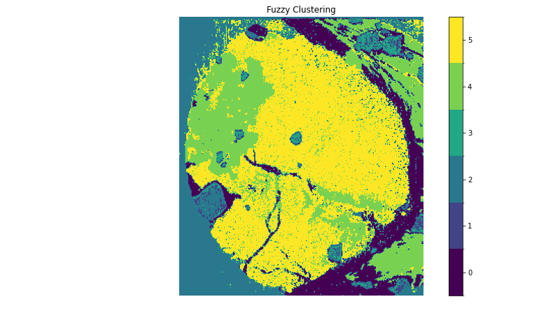
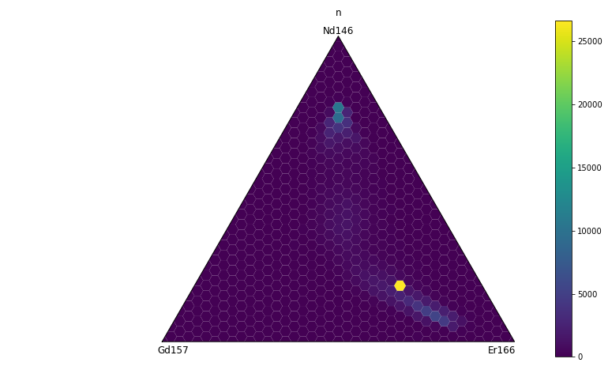
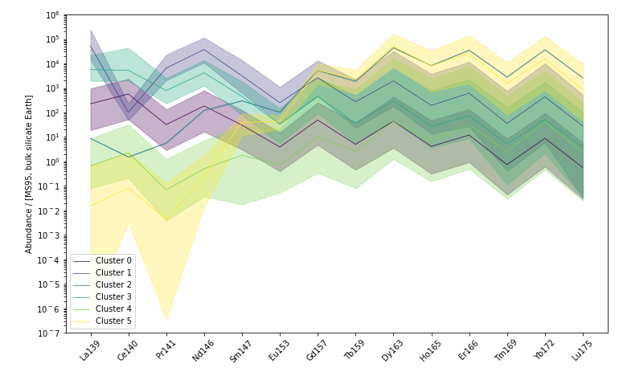

# Laser Map Explorer (LaME)

## Overview

Laser Map Explorer (LaME) is an innovative software tool developed by researchers in the University of Adelaide, Earth Sciences Department.  The work is supported by the MinEx CRC.  LaME is designed for processing and visualizing multi-analyte maps of minerals, whether it be LA-ICP-MS maps of isotopes, XRF maps of elements, or some other imaging method. The software aims to simplify the complex task of handling large volumes of map-form data via an intuitive user interface.

## Features

* Analyte Selection: Simple intuitive window to choose analytes used for analysis, create ratios and apply transformations (e.g., log).

* Cluster Analysis: Enables effective categorization and analysis of geochemical data.

* Geochemical Plotting: Offers various plotting capabilities for both qualitative and quantitative analysis of mineral maps.
- Ternary Plot

- Trace Element Compatibility Plots

* User-Friendly Interface: Streamlined data handling process, making it accessible to users with varying levels of expertise.

* Multi-view: Large canvas for multiple plots

LaME is demonstrated using data from garnet-chlorite schists found in the Walter-Outalpa Shear Zone, South Australia.

## Planned functionality:

* Create custom maps and layouts
* Produce chemical profiles
* Diffusion modeling (1D and 2D)
* Temperature calculations
* Date estimates/maps for selected
* Isotopic systems
* Batch processing of multiple samples
* Calculator for custom field generation

## Development and Availability

Currently in the prototype phase developed using Matlab.
Expected GitHub release: April 2024.

## Contribution

Contributions are welcome! If you have suggestions or enhancements, please fork the repository and open a pull request.

