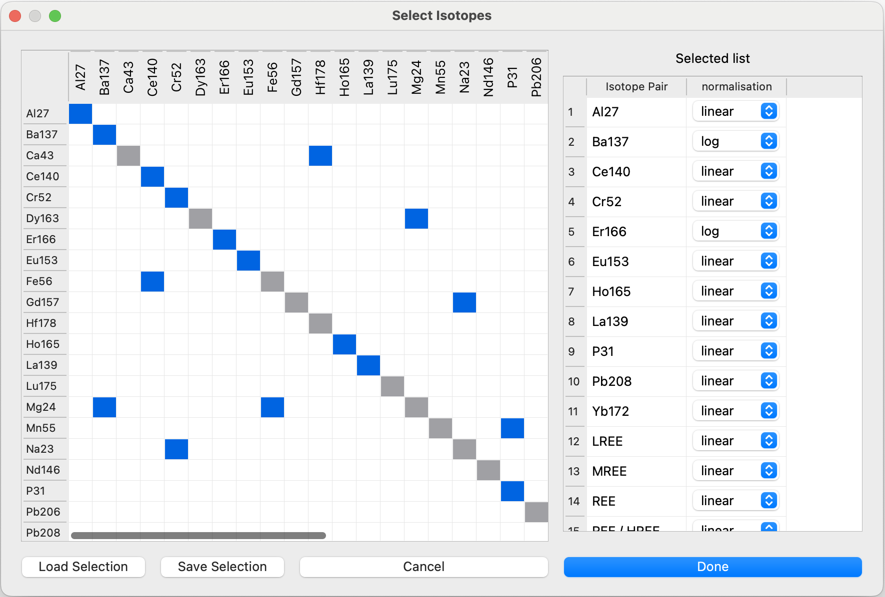
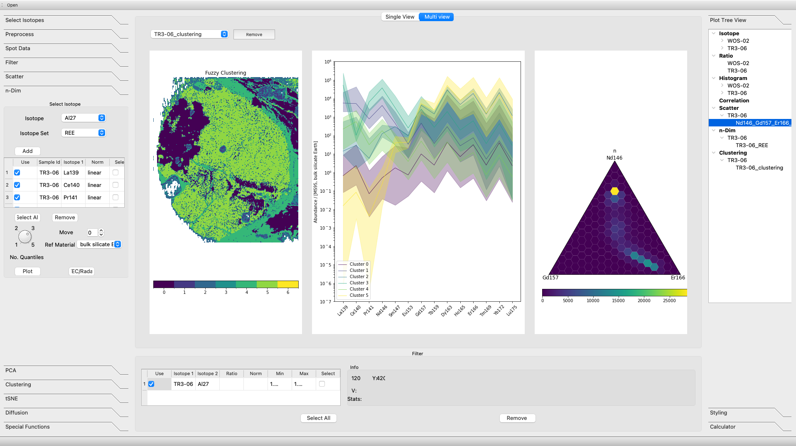

# Laser Map Explorer (LaME)

## Overview

Laser Map Explorer (LaME) is an innovative software tool developed by Derrick Hasterok and his team. It is designed for processing and visualizing multi-element and isotope maps of minerals. The software aims to simplify the complex task of handling large volumes of geochemical data through an intuitive user interface.

## Features

Isotope Selection: Simple intuitive window to choose elements used for analysis, create ratios and apply vaious scaling and transformation techniques.

Cluster Analysis: Enables effective categorization and analysis of geochemical data.

Geochemical Plotting: Offers various plotting capabilities for both qualitative and quantitative analysis of mineral maps.

User-Friendly Interface: Streamlined data handling process, making it accessible to users with varying levels of expertise.
Demonstration

Multi-view: Large canvas for multiple plots

LaME is demonstrated using data from garnet-chlorite schists found in the Walter-Outalpa Shear Zone, South Australia.

## Planned functionality:

* Create custom maps and layouts
* Produce chemical profiles
* Diffusion modeling (1D and 2D)
* Temperature calculations
* Date estimates/maps for selected
* Isotopic systems
* Batch processing of multiple samples
* Calculator for custom field generation

## Development and Availability

Currently in the prototype phase developed using Matlab.
Expected GitHub release: April 2024.

## Contribution

Contributions are welcome! If you have suggestions or enhancements, please fork the repository and open a pull request.

