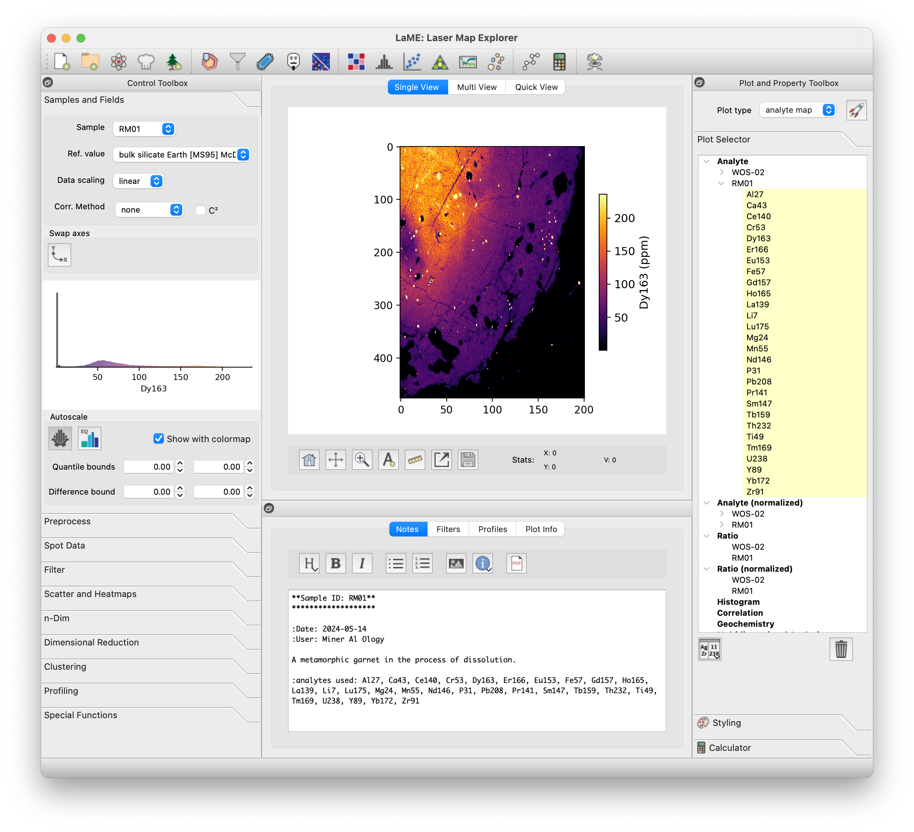
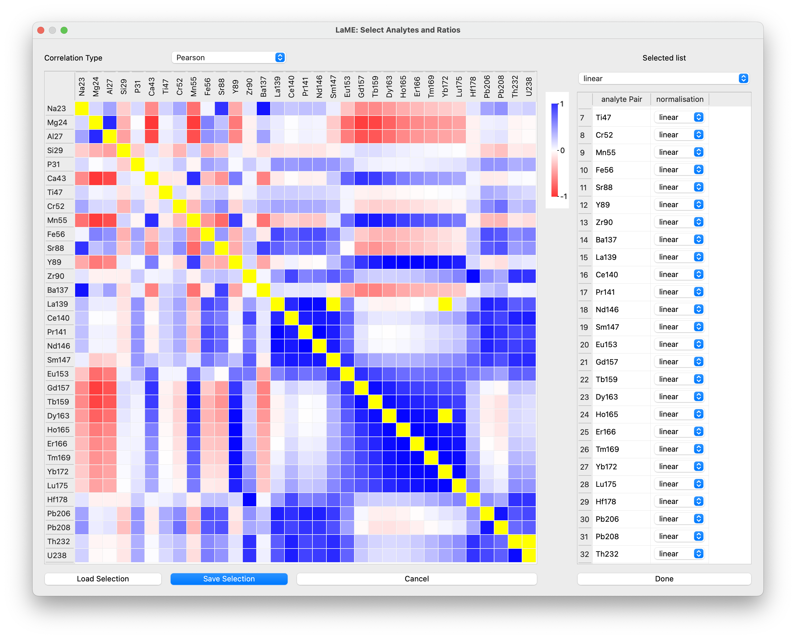
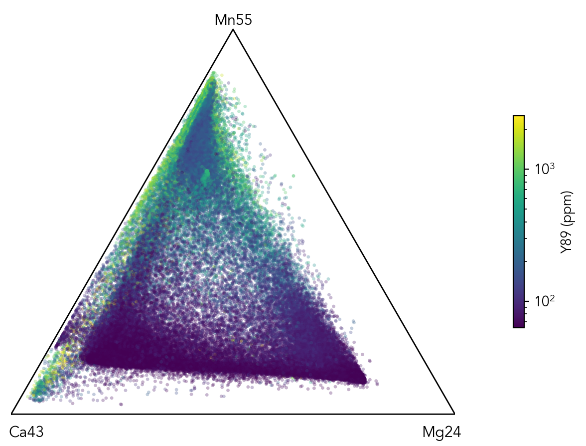
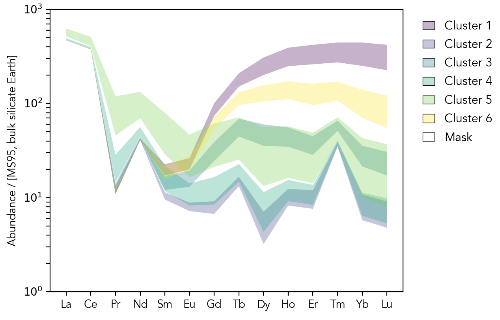
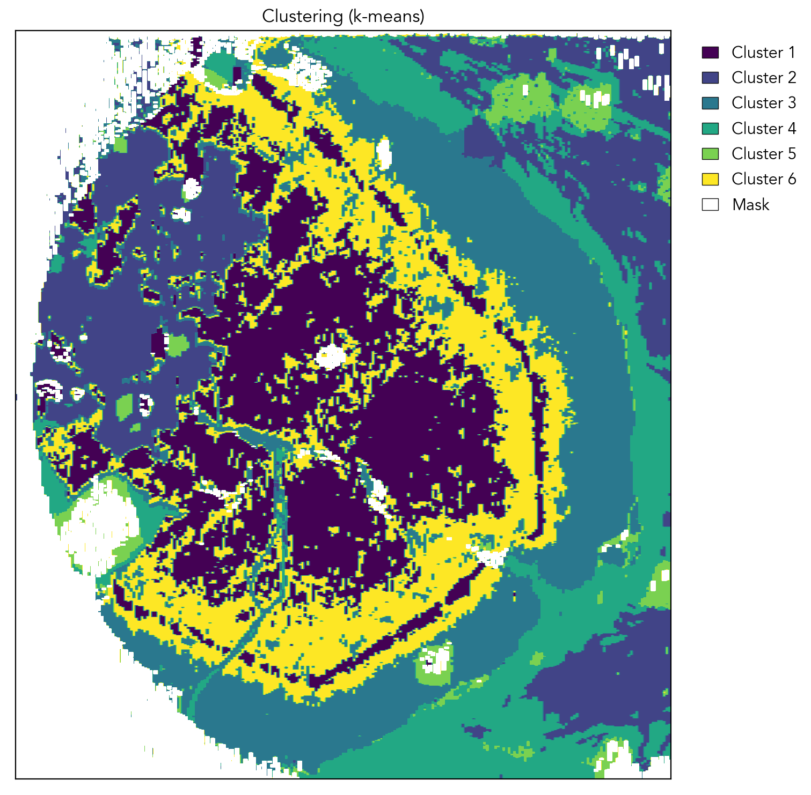

# Laser Map Explorer (LaME)

## Overview

Laser Map Explorer (LaME) is an innovative software tool developed by researchers in the University of Adelaide, Earth Sciences Department.  The work is supported by the MinEx CRC.  LaME is designed for processing and visualizing multi-analyte maps of minerals, whether it be LA-ICP-MS maps of isotopes, XRF maps of elements, or some other imaging method. The software aims to simplify the complex task of handling large volumes of map-form data via an intuitive user interface.



## Features

* Analyte Selection: Simple intuitive window to choose analytes used for analysis, create ratios and apply transformations (e.g., log).  Simply click on the desired analyte along the diagonal to turn add/remove it from analysis.  Add ratios by clicking on the row and column desired.
<center></center>

* Geochemical Plotting: Offers various plotting capabilities for both qualitative and quantitative analysis of mineral maps.
- Biplot (scatter and heatmaps)
- Ternary plots (scatter and heatmaps)
<center></center>

- Trace element compatibility diagrams
<center></center>

- Radar plots

* Multidimensional Analysis: Enables effective categorization and analysis of geochemical data that can be used to separate regions of the sample (e.g., TEC diagram above)
<center></center>

Figures produced using LaME with garnet-chlorite schists from the Walter-Outalpa Shear Zone, South Australia.

* User-Friendly Interface: Streamlined data handling process, making it accessible to users with varying levels of expertise.
- Note taking capability
- Integrated web-browser that links to the user guide and documentation

* Multiple Plot Views: Large canvas for displaying multiple plots
- Multiview, display multiple plots plots for comparison/interpretation
- Quickview, get a quick overview of the data using preset or user defined data displays.

<center></center>

* Customizable
- Style pane for customizing figures
- Import custom colormaps
- Set prefered data views

## Planned functionality:

* Produce chemical profiles
* Diffusion modeling (1D and 2D)
* Temperature calculations
* Date estimates/maps for selected
* Isotopic systems
* Batch processing of multiple samples
* Calculator for custom field generation

## Installation

LaME depends on several sibling packages that must be installed as editable installs from their local repositories before installing LaME itself.

### 1. Clone sibling repositories

```bash
git clone https://github.com/dhasterok/lame-core ../lame-core
git clone https://github.com/dhasterok/blueberry-colortools ../blueberry-colortools
git clone https://github.com/dhasterok/siesta-rest-editor ../siesta-rest-editor
```

The repositories should sit alongside the `LaserMapExplorer` directory:

```
GitHub/
├── LaserMapExplorer/
├── lame-core/
├── blueberry-colortools/
└── siesta-rest-editor/
```

### 2. Install dependencies

```bash
pip install -r requirements.txt
```

This installs the sibling packages in editable mode (`-e`) along with all other dependencies.

### Package architecture

| Package | Role |
|---------|------|
| `lame-core` | Shared widgets, theming, icon resources, and path configuration |
| `blueberry-colortools` | Colour picker, colormap editor, and colormap data (custom and ternary colormaps) |
| `siesta-rest-editor` | reStructuredText note editor |
| `LaserMapExplorer` | Main application |

## Development and Availability

Currently in active development (beta).

## Contribution

Contributions are welcome! If you have suggestions or enhancements, please fork the repository and open a pull request.


