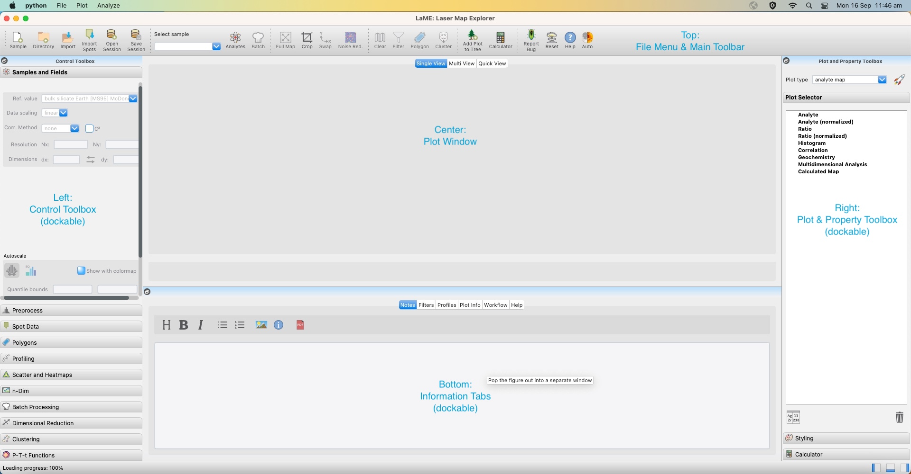

The Basics
**********

GUI Layout
==========
The *LaME* user interface is organized into five main panels:

* *Main Toolbar* (Top): File operations and frequently used functions
* *Control Toolbox* (Left): Data analysis and visualization tools
* *Plot and Property Toolbox* (Right): Plot management, styling, and custom field calculations
* *Plot Window* (Center): Visualization area with single plot, multiple plot, and quick view modes
* *Lower Tabs*: Documentation, filtering, profile analysis, and help resources

    The *LaME* interface showing the five main panels.

Getting Started
===============

To begin using *LaME*, first load a directory using either the *File Menu* or the directory button (|icon-add-directory|) in the *Main Toolbar*.  If you haven't loaded a sample previously, import your data and the imported sample will be automatically added to the sample list dropdown in the *Main Toolbar*.  For previously analyzed samples, you can load a saved session, a single sample, or a directory of samples.  See :doc:`import` for supported file specifications.

Once a directory is loaded, select a sample using the sample list dropdown in the *Main Toolbar*.  To choose the fields for analysis, use the *Analyte Selector* (|icon-atom|) to select elements and ratios. More details on this process can be found in the :doc:`top_toolbar` section.

With data loaded and fields selected, various tools in the *Control Toolbox* and *Plot and Property Toolbox* can be used to analyze and visualize the data. All work on previous samples will be stored, and any images can be recalled from the *Plot Selector* in the *Plot and Property Toolbox*.

For a detailed explanation of the *Control Toolbox* and its features, refer to the :doc:`left_toolbox` section. Similarly, for information about the *Plot and Property Toolbox* and its capabilities, see the :doc:`right_toolbox` section.

These toolboxes provide essential functions for data analysis, visualization, and customization in *LaME*.  Familiarizing yourself with their features will greatly enhance your ability to explore and analyze your data effectively.

Structure of Stored Data
========================

It is useful to know how data are stored within the program, as some operations will clear analyses and associated figures when the underlying data are changed.  *LaME* keeps three versions of the data: raw data (original data), preprocessed data (clipped data), and analysis data (filtered and/or masked).

Raw data
--------

Raw data refers to the data read directly from a file.  It may be uncalibrated (e.g., cps) or calibrated (e.g., ppm).  Currently, *LaME* does not calibrate LA-ICP-MS data, so any calibrated data should be calibrated in Iolite or XMapTools first.

Cropping ( |icon-crop| ) can be applied to the raw data, reducing the area analyzed by the code.  The original extent can be restored by clicking the |icon-fit-to-width| button.  If the raw data is cropped or restored to the original extent, these operations result in clearing any figures or analyses.  A dialog will appear prompting the user if they wish to proceed before clearing the memory.

Preprocessed data
-----------------

Preprocessed data refers to data that has undergone initial processing steps. The preprocessing includes several potential operations to reduce issues with analyses such as autoscaling (|icon-autoscale|) and rescaling to remove negative values. While it may alter the values of some data points, it does so by improving stability of some processing methods (e.g., PCA and clustering) that are otherwise skewed by extreme outliers or cannot handle negative values. These outliers often result from point measurement errors or incorrect calibrations related to differences in mineral ablation properties. These preprocessing data steps are described in greater detail in the preprocessing subsection of the :doc:`left_toolbox`.

Analysis data
-------------

There are three types of :doc:`filters <filtering>` that can be applied to exclude data from analyses and geochemical plots: elemental filters (on = |icon-filter2|, off = |icon-filter| ), polygon masking (on = |icon-polygon-new|, off = |icon-polygon-off| ), and cluster masking (on = |icon-mask-dark|, off = |icon-mask-light| ).  These filters can be used in any combination and toggled on or off as required.  Each is implemented as a simple pixel-by-pixel mask. Filters can be toggled using the corresponding icons in the *Main Toolbar*. All filters/masks can be disabled by clicking the |icon-map| button.

The analysis data are used to produce plots and compute analyses; turning filters and masks on or off results in their recomputation of the analysis data. 

.. |icon-atom| image:: _static/icons/icon-atom-64.png
    :height: 2ex

.. |icon-crop| image:: _static/icons/icon-crop-64.png
    :height: 2ex

.. |icon-fit-to-width| image:: _static/icons/icon-fit-to-width-64.png
    :height: 2ex

.. |icon-autoscale| image:: _static/icons/icon-autoscale-64.png
    :height: 2ex

.. |icon-map| image:: _static/icons/icon-map-64.png
    :height: 2ex

.. |icon-filter| image:: _static/icons/icon-filter-64.png
    :height: 2ex

.. |icon-filter2| image:: _static/icons/icon-filter2-64.png
    :height: 2ex

.. |icon-mask-light| image:: _static/icons/icon-mask-light-64.png
    :height: 2ex

.. |icon-mask-dark| image:: _static/icons/icon-mask-dark-64.png
    :height: 2ex

.. |icon-polygon-new| image:: _static/icons/icon-polygon-new-64.png
    :height: 2ex

.. |icon-polygon-off| image:: _static/icons/icon-polygon-off-64.png
    :height: 2ex