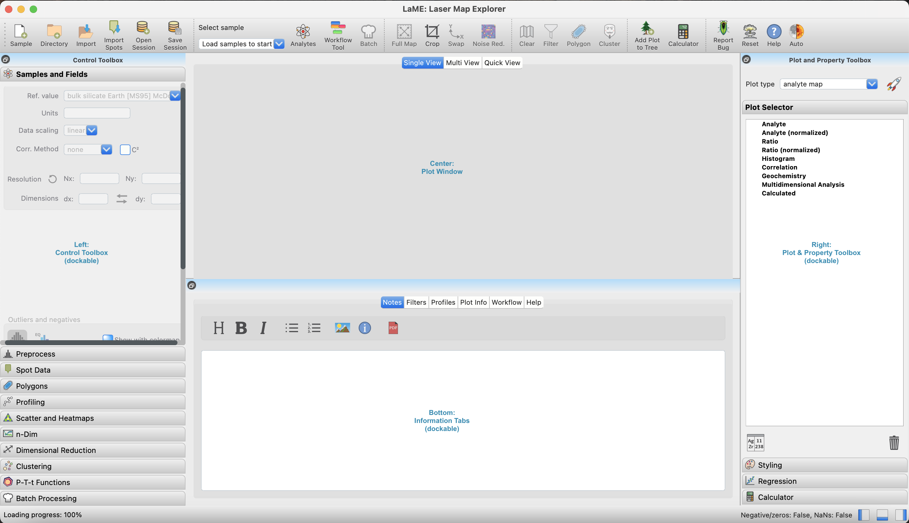

The Basics
**********

GUI Layout
==========
LaME's user interface is organized into four panels:

* left, toolbox with functions for plotting and analysis
* right, toolbox with a plot selection tree, plot styles, and a calculator for creating custom fields
* center, plot viewer tabs for single plots, multiple plots, and a quick view of all fields
* bottom, tabs for notes, selected filters, and profile plots

Once LaME starts, you will need to load a directory, either from the file menu or toolbar ( |icon-add-directory| ).  You can load a directory with a single sample or a directory with multiple samples, each in their own subdirectory.  See import formats :doc:`import` for file specifications that LaME can handle.

    The LaME interface on start-up and labeled panels.

Loading Data
============

Where to Start
==============

Once a directory is loaded, changing samples is easy.  From the *Sample and Field* tab, use the sample dropdown to select the desired sample.  All work on previous samples will be stored and any images can be recalled from the *Plot Selector* in the right panel.

Use Isotope Selector ( |icon-atom| ) to choose the fields to be used for analysis, including ratios between elements/isotopes.  Generally the more isotopes selected for analysis, the better.  To aid selection of ratios, the background of the *Analyte Selector* tool are the correlation coefficients between every pair of fields (Figure 1).  When the sample first loads, all isotopes are selected (highlighted in yellow).  To select or deselect an isotope, click on the diagonal corresponding to the isotope.  To select or deselect a ratios, simply by click on the row and column corresponding to the pair.  The column corresponds to the numerator and the row to the denominator of the ratio.  Once selected, the ratio will be highlighed in yellow in the table and be added to the selection list on the right.  When finished, click *Done*.

To load a previously saved set of isotopes and ratios, click *Load Selection*.

.. figure:: _static/screenshots/LaME_Analyte_Selector.png
    :align: center
    :alt: isotope selection tool

    Isotope selection tool, with isotopes and ratios selected.

Stucture of stored data
=======================

It is useful to know how data are stored within the program as some operations will clear analyses and associated figures when the underlying data are changed.  There are three versions of the data kept within the program: *raw data*, original data; *clippped data*, preprocessed data; and *analysis data*, data that are filtered and/or masked.

Raw data
--------

The *raw data* refers to the data read from a file.  The raw data may be uncalibrated (e.g., cps) or calibrated (e.g., ppm).  LaME does not calibrate LA-ICP-MS data at present, so the any calibrated data should be calibrated in Iolite or XMapTools first.

Cropping ( |icon-crop| ) is applied to the *raw data*, reducing the area analyzed by the code.  The original extent can be restored by clicking the |icon-fit-to-width| button.  The *clipped data* and *analysis data* must be recomputed from *raw data* if the *raw data* is cropped or restored to the original extent.  These operations result in clearing any figures or analyses.  A dialog will appear prompting the user if they wish to proceed before clearing the memory.

Clipped data
------------

The *clipped data* refers to data that are preprocessed.  The preprocessing steps include several potential operations meant to reduce issues with analyses including autoscaling ( |icon-autoscale| ) and rescaling to remove negative values.  While it may alter the values of some data points, it does so by improving stability of some processing methods (e.g., PCA and clustering) that are otherwise skewed by extreme outliers or cannot handle negative values.  These outliers often result from point measurement errors or incorrect calibrations related to differences in mineral ablation properties.  These preprocessing data steps are described in greater detail in the preprocessing subsection (:doc:`left_toolbox`).

Analysis data
-------------

There are three types of filters than can be applied to exclude data from analyses and geochemical plots.  These include elemental filters (on = |icon-filter2|, off = |icon-filter| ), polygon masking (on = |icon-polygon-new|, off = |icon-polygon-off| ), and cluster masking (on = |icon-mask-dark|, off = |icon-mask-light| ).  It is possible to use any combination of these and turn them on or off as required.  Each are implemented as a simple pixel by pixel mask.  They can be turned on or off by clicking the icon found in the *Filter tab* on the left and grouped in *Data for analysis*.  All filters/masks can be turned off by clicking the |icon-map| button.  Note, the filters will automatically be turned on when they are first created.

The *analysis data* are used to produce plots and compute analyses; turning filters and masks on or off results in their recomputation. 

.. |icon-add-directory| image:: _static/icons/icon-add-directory-64.png
    :height: 2ex

.. |icon-atom| image:: _static/icons/icon-atom-64.png
    :height: 2ex

.. |icon-crop| image:: _static/icons/icon-crop-64.png
    :height: 2ex

.. |icon-fit-to-width| image:: _static/icons/icon-fit-to-width-64.png
    :height: 2ex

.. |icon-autoscale| image:: _static/icons/icon-autoscale-64.png
    :height: 2ex

.. |icon-map| image:: _static/icons/icon-map-64.png
    :height: 2ex

.. |icon-filter| image:: _static/icons/icon-filter-64.png
    :height: 2ex

.. |icon-filter2| image:: _static/icons/icon-filter2-64.png
    :height: 2ex

.. |icon-mask-light| image:: _static/icons/icon-mask-light-64.png
    :height: 2ex

.. |icon-mask-dark| image:: _static/icons/icon-mask-dark-64.png
    :height: 2ex

.. |icon-polygon-new| image:: _static/icons/icon-polygon-new-64.png
    :height: 2ex

.. |icon-polygon-off| image:: _static/icons/icon-polygon-off-64.png
    :height: 2ex