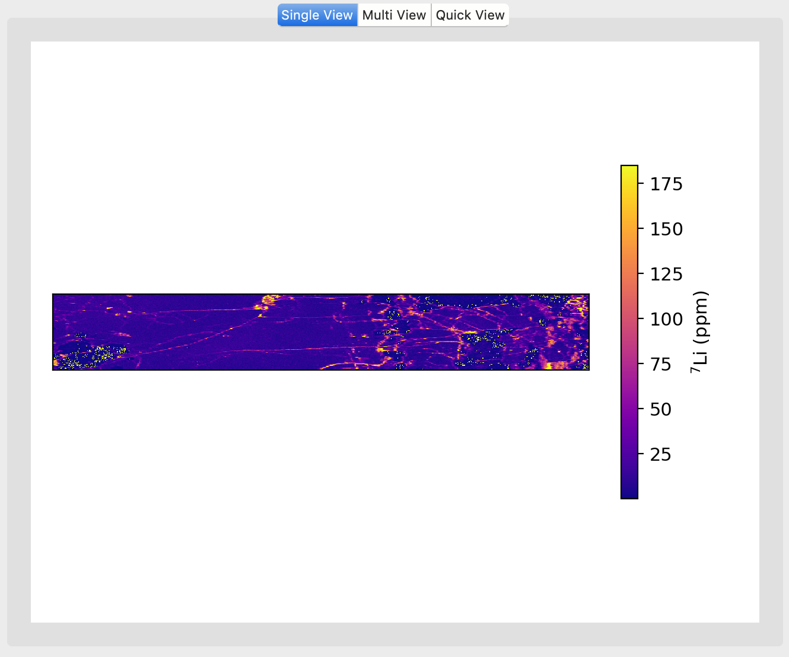

Plot Window (Center)
********************

The Plot Window, located in the center of the LaME interface, is the primary area for displaying visual representations of your data. It offers three distinct viewing modes to suit different analysis needs.

   The Plot Window displaying multiple plots in Multi View mode.

Single View
===========

The Single View mode displays one plot at a time, allowing for a detailed examination of individual plots. This mode is particularly useful when you need to focus on a specific analyte or plot type. In Single View, you can easily add labels and annotations to your plot, enhancing its informativeness. It's also the ideal mode for creating and editing polygons for data selection, giving you precise control over your analysis area.

Multi View
==========

Multi View mode enables the simultaneous display of multiple plots, offering a comparative perspective on your data. This mode is invaluable when you need to compare different analytes or plot types side by side. It's especially useful for creating figures with multiple subplots for reports or publications. Additionally, Multi View facilitates the efficient generation of coincident multianalyte traverses, allowing you to observe relationships between different elements or properties across your sample.

Quick View
==========

Multi View mode enables the simultaneous display of multiple plots, offering a comparative perspective on your data. This mode is invaluable when you need to compare different analytes or plot types side by side. It's especially useful for creating figures with multiple subplots for reports or publications. Additionally, Multi View facilitates the efficient generation of coincident multianalyte traverses, allowing you to observe relationships between different elements or properties across your sample.