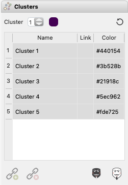

Cluster Dock
************

Clustered data can be assigned a name and color.  A checked cluster or clusters can be used to mask (|icon-mask-dark|) or reverse mask (|icon-mask-light|) data in a plot or on a map.  See `Clustering <multidimensional.html#clustering>`_ for more details on cluster analysis.

Linking clusters into one class
-------------------------------

A clustering run often splits a single mineral across several clusters that differ only
in something uninteresting, such as ablation depth.  Those clusters can be **linked** so
that everything downstream treats them as one class.  Check the clusters in the *Cluster
Table* and click |icon-link| to link them, or |icon-unlink| to split them apart again.

Linking never re-clusters anything: the underlying cluster labels are untouched, so
unlinking restores the original classes exactly.  What changes is how a class is shown
and analyzed:

* the linked clusters take the color and name of the lowest-numbered member, so they draw
  as one class on the cluster map and appear once in the legend;
* they show their group in the *Link* column;
* checking any member checks the whole class, so the cluster mask covers all of it;
* plots that are drawn per cluster -- histograms by cluster, multi-pixel isochrons --
  produce one pooled result for the class instead of one per member.

To analyze the classes, check them and click |icon-roi-add| (*Create Region*).  Each
linked class becomes one region of interest, and each unlinked cluster becomes a region of
its own.  From that point they behave like any other region of interest: they appear in
the *ROI* table, in the ROI map, in the region percentages, and in the per-region
statistics of the *Stoichiometry* dock (choose ``ROI`` as the region column).  Running
*Create Region* again refreshes the regions made from the same clusters rather than adding
duplicates.

.. note::

   A region records *which clusters* it was made from, not which pixels, so re-running
   clustering rebinds it to the new clusters carrying those numbers -- check your regions
   after re-clustering.  Re-running clustering also clears the links, since the clusters
   they referred to no longer exist.  Neither the links nor the regions of interest are
   saved in the project file.

.. |icon-link| image:: _static/icons/icon-link-64.svg
    :height: 2ex

.. |icon-unlink| image:: _static/icons/icon-unlink-64.svg
    :height: 2ex

.. |icon-roi-add| image:: _static/icons/icon-roi-add-64.svg
    :height: 2ex

.. |icon-mask-light| image:: _static/icons/icon-mask-light-64.svg
    :height: 2ex

.. |icon-mask-dark| image:: _static/icons/icon-mask-dark-64.svg
    :height: 2ex

    The Styling \> Clustering contains options for working with clustered data
