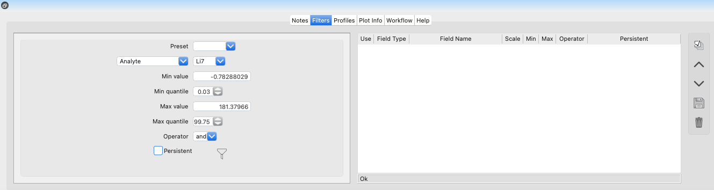
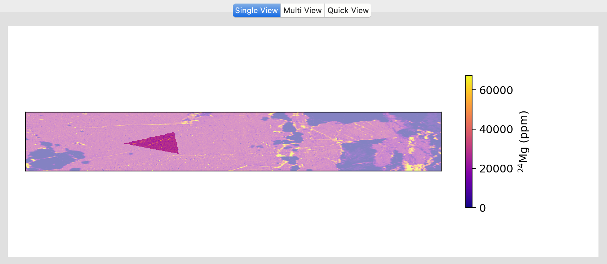
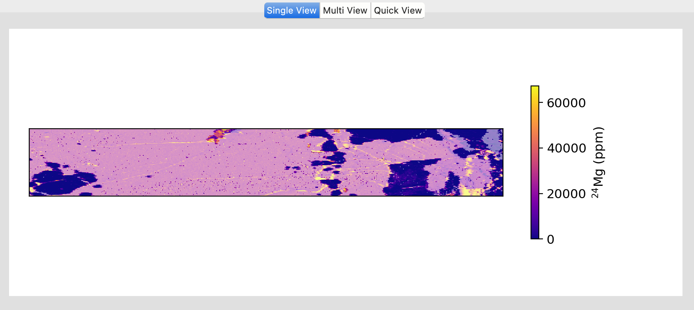

Filter
******

*LaME* offers three types of filters to exclude data from analyses and geochemical plots: 

* Filters by value (|icon-filter|): Created in the *Filter* tab of the *Lower Tab*.
* Polygon masking (|icon-polygon-new|): Managed in the *Polygon* table of the *Control Toolbox*.
* Cluster masking (|icon-mask-dark|): Set from *Styling > Clusters* in the *Plot and Property Toolbox*.

These can be used individually or in combination to isolate specific features or exclude unwanted data from analyses.  Users can easily toggle these filters on or off using the *Top Toolbar* for quick access. To disable all filters and masks at once, click the |icon-map| button. 

Filter by value
===============

Value filters allow selection of data based on concentration thresholds. These filters can be created and modified in the *Filter* tab of the :doc:`lower_tabs`. Multiple filters can be combined using AND/OR operations for complex selection criteria.

   Plot displaying the filter by value.

To create a value filter:

1. Select the field type and specific field from the dropdown menus
2. Set minimum and maximum bounds either as absolute values or percentiles
3. Click the |icon-filter| button to add the filter

Multiple filters may be combined to produce more complex filters.  The filters include a boolean operator (*and* and *or*) to assist with precisely defining filters to capture the desired regions for analysis and plotting.  In many cases, the overlap between values may make it difficult to separate phases.  In these cases, we suggest targeting specific regions with a polygon or cluster mask.

Polygon Masking
===============

   Plot displaying the polygon mask.

Polygons can be used to filter specific regions of your data, to create a polygon mask::

1. Click the New Polygon button (|icon-polygon-new|)
2. Left-click to place vertices on the map
3. Right-click to complete the polygon

*LaME* allows you to create multiple polygons, which can be analyzed as separate regions or linked for combined analysis. To link or delink polygons, select multiple entries in the *Polygon Table* and click the |icon-link| or |icon-unlink| button. You can toggle the use of individual polygons in analyses by clicking the associated checkbox in the *Polygon Table*.

Edge-detection
--------------

To aid with the identification of mineral boundaries, you can turn on edge detection by clicking the |icon-spotlight| button. There are multiple edge detection methods available (Sobel, Canny, zero-cross) which you can select using the dropdown menu.  Edge-detection is useful for locating the boundaries of polygons.  The use of edge detection does not affect analyses.

Cluster Masking 
===============

   Plot displaying the cluster mask.

Cluster masks utilize multivariate clustering results to filter data. Before creating cluster masks, clustering must first be performed using the Clustering tab in the :doc:`left_toolbox`.  Once clusters are computed, create masks through the *Styling* tab in the *Plot and Property Toolbox*. 

1. Select one or more clusters in the cluster table
2. Click either:
   
   - Group Mask (|icon-mask-dark|) to mask selected clusters
   - Inverse Group Mask (|icon-mask-light|) to mask unselected clusters
3. Toggle the cluster mask using the toolbar button

For detailed information about clustering methods and implementation, see `Clustering <multidimensional.html#clustering>`_.

.. |icon-filter| image:: _static/icons/icon-filter-64.png
    :height: 2.5ex
   
.. |icon-map| image:: _static/icons/icon-map-64.png
    :height: 2.5ex

.. |icon-link| image:: _static/icons/icon-link-64.png
    :height: 2.5ex

.. |icon-unlink| image:: _static/icons/icon-unlink-64.png
    :height: 2.5ex

.. |icon-open-file| image:: _static/icons/icon-open-file-64.png
    :height: 2.5ex

.. |icon-save-file| image:: _static/icons/icon-save-file-64.png
    :height: 2.5ex

.. |icon-mask-light| image:: _static/icons/icon-mask-light-64.png
    :height: 2.5ex

.. |icon-mask-dark| image:: _static/icons/icon-mask-dark-64.png
    :height: 2.5ex

.. |icon-polygon-new| image:: _static/icons/icon-polygon-new-64.png
    :height: 2.5ex

.. |icon-spotlight| image:: _static/icons/icon-spotlight-64.png
    :height: 2.5ex

.. |icon-polygon-off| image:: _static/icons/icon-polygon-off-64.png
    :height: 2.5ex