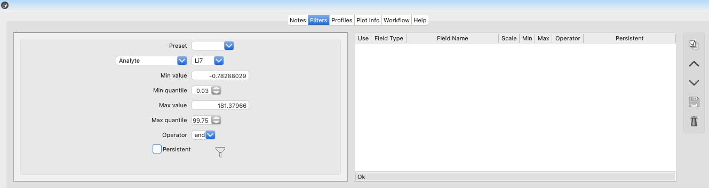
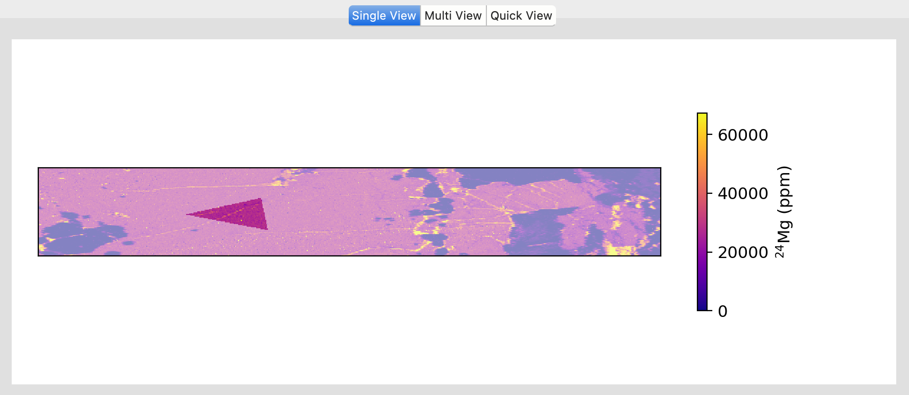
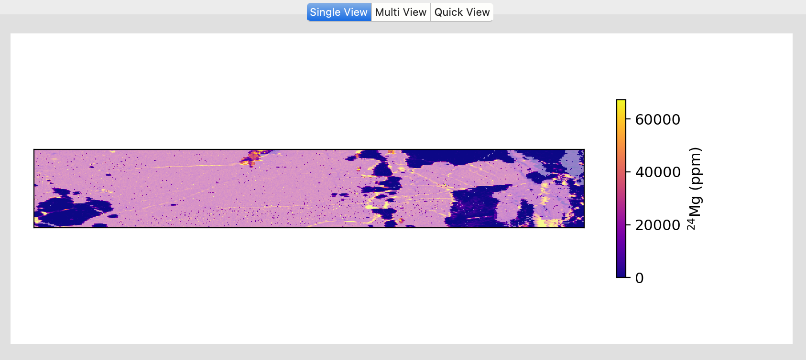
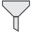
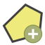
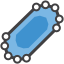
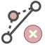

Filter
******

*LaME* offers three types of filters to exclude data from analyses and geochemical plots: 

* Filters by value (|icon-filter|): Created in the *Filter* tab of the *Lower Tab*.
* Polygon masking (|icon-polygon-new|): Managed in the *Polygon* table of the *Control Toolbox*.
* Cluster masking (|icon-mask-dark|): Set from *Styling > Clusters* in the *Plot and Property Toolbox*.

These can be used individually or in combination to isolate specific features or exclude unwanted data from analyses.  Users can easily toggle these filters on or off using the *Top Toolbar* for quick access. To disable all filters and masks at once, click the |icon-map| button. 

Filter by value
===============

Value filters allow selection of data based on concentration thresholds. These filters can be created and modified in the *Filter* tab of the :doc:`lower_tabs`. Multiple filters can be combined using AND/OR operations for complex selection criteria.

   Plot displaying the filter by value.

To create a value filter:

1. Select the field type and specific field from the dropdown menus
2. Set minimum and maximum bounds either as absolute values or percentiles
3. Click the |icon-filter| button to add the filter

Multiple filters may be combined to produce more complex filters.  The filters include a boolean operator (*and* and *or*) to assist with precisely defining filters to capture the desired regions for analysis and plotting.  In many cases, the overlap between values may make it difficult to separate phases.  In these cases, we suggest targeting specific regions with a polygon or cluster mask.

Polygon Masking
===============

   Plot displaying the polygon mask.

Polygons can be used to filter specific regions of your data, to create a polygon mask:

1. Click the New Polygon button (|icon-polygon-new|)
2. Left-click to place vertices on the map
3. Right-click to complete the polygon

While placing vertices, press ``z`` to remove the last one or ``Esc`` to abandon the polygon.
These shortcuts act on the map, so click the map once first to give it keyboard focus.

Editing a polygon
^^^^^^^^^^^^^^^^^

Clicking inside a polygon on the map selects it (its row in the *Polygon Table* follows), and
the selected polygon shows its vertices as red handles. Three toolbar buttons reshape it:

- |icon-move-point| *Move Point*: drag a handle to move that vertex. Drag from inside the
  polygon, away from any handle, to move the whole polygon.
- |icon-add-point| *Add Point*: click on one of the polygon's edges to insert a vertex there.
- |icon-remove-point| *Remove Point*: click a handle to remove that vertex. A polygon always
  keeps at least three vertices.

Only one of the three can be active at a time; click the button again, press ``Esc`` or
right-click the map to leave the mode. The polygon mask and any regions made from the
polygon update as soon as an edit is finished.

Polygons belong to the field map. Switching to another plot type turns polygon mode off
(the polygons and their mask are kept; switch back to the field map and turn polygon mode
on again to keep editing). Clustering ignores polygons altogether: clusters are always
computed over the whole map and the cluster map shows every pixel, whatever polygons have
been drawn. To analyse just the area inside a polygon, use *Create Region* below.

To delete polygons, select one or more rows in the *Polygon Table* and either click the
Delete button on the tab's toolbar, press ``Delete``, or right-click the selection and choose
*Delete Polygon*. A polygon selected on the map (click inside it) can also be removed with
``Delete`` without going through the table.

While a polygon is being drawn, the map is shown in full so the area being outlined stays
visible; once it is complete, everything outside the selection is dimmed to keep the focus
on the selected region. The color and strength of that dimming can be set with *Mask color*
and *Mask opacity* on the *Text and Scales* page of the *Styling Toolbox*.

*LaME* allows you to create multiple polygons. Regions are **combined**, so several polygons
select all of their areas together, and every polygon is drawn on the map. Each row of the
*Polygon Table* has an *In/out* setting: *In* keeps the enclosed area, while *Out* removes it
from the selection, which is how a hole is cut in a larger region (an *Out* polygon is drawn
with a dashed outline). With no *In* polygon, an *Out* polygon simply excludes its own area.
You can toggle the use of individual polygons in analyses by clicking the associated checkbox
in the *Analysis* column of the *Polygon Table*, and use the |icon-polygon-new| toolbar
button to turn the whole polygon mask on or off without discarding the polygons.

Linking polygons into regions
-----------------------------

By default each polygon is its own region.  Several polygons that outline the same thing --
for example every grain of one mineral -- can be **linked** so they are analyzed together as
a single region.  Select the rows in the *Polygon Table* and click |icon-link| to link them,
or |icon-unlink| to split them apart again.  Linked polygons share a color on the map and
show their group in the *Link* column.  Linking never changes which pixels are selected; it
changes what counts as one region.

An *Out* polygon that is linked into a group cuts its hole in **that group only**, so an
inclusion can be excluded from one grain without affecting any other region.  An *Out*
polygon that is not linked keeps subtracting from the whole map.

To analyze the regions, select the polygons and click |icon-roi-add| (*Create Region*).  Each
linked group becomes one region of interest, and each unlinked polygon becomes a region of
its own.  From that point they behave like any other region of interest: they appear in the
*ROI* table, in the ROI map, in the region percentages, and in the per-region statistics of
the *Stoichiometry* dock (choose ``ROI`` as the region column).  Running *Create Region*
again refreshes the regions made from the same polygons rather than adding duplicates, so
reshaping a polygon just means clicking it once more.

.. note::

   A region is a snapshot of the polygons it was made from, and regions of interest are not
   saved in the project file.  The polygons and their groups *are* saved, so the regions can
   be recreated in one click after reopening a project.

Edge-detection
--------------

To aid with the identification of mineral boundaries, you can turn on edge detection by clicking the |icon-spotlight| button. There are multiple edge detection methods available (Sobel, Canny, zero-cross) which you can select using the dropdown menu.  Edge-detection is useful for locating the boundaries of polygons.  The use of edge detection does not affect analyses.

Cluster Masking 
===============

   Plot displaying the cluster mask.

Cluster masks utilize multivariate clustering results to filter data. Before creating cluster masks, clustering must first be performed using the Clustering tab in the :doc:`left_toolbox`.  Once clusters are computed, create masks through the *Styling* tab in the *Plot and Property Toolbox*. 

1. Select one or more clusters in the cluster table
2. Click either:
   
   - Group Mask (|icon-mask-dark|) to mask selected clusters
   - Inverse Group Mask (|icon-mask-light|) to mask unselected clusters
3. Toggle the cluster mask using the toolbar button

For detailed information about clustering methods and implementation, see `Clustering <multidimensional.html#clustering>`_.

   

.. |icon-polygon-off| image:: _static/icons/icon-polygon-off-64.svg
    :height: 2.5ex