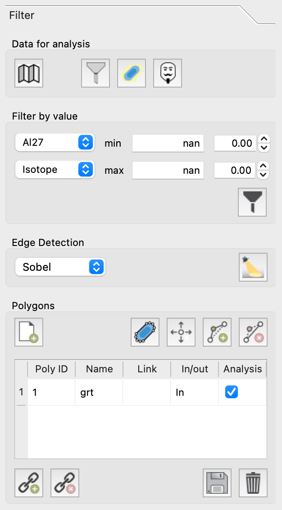

Filter
******

*LaME* offers three types of filters to exclude data from analyses and geochemical plots: 

* Filters by value (|icon-filter2|): Created in the *Filter* tab of the *Lower Tab*.
<<<<<<< HEAD
* Polygon masking (|icon-polygon-new|): Managed in the *Polygo*n table of the right toolbox.
=======
* Polygon masking (|icon-polygon-new|): Managed in the *Polygon* table of the right toolbox.
>>>>>>> temp-branch
* Cluster masking (|icon-mask-dark|): Set from *Styling > Clusters* in the left toolbox.

It's possible to use any combination of these filters and masks. You can easily toggle them on or off using the top toolbar for quick access. To disable all filters and masks at once, click the |icon-map| button in the top toolbar.

    The *Filter* tab contains tools for filtering by value creating polygons.  It also contains an edge detection algorithm, useful for creating polygons.

Filter by value |icon-filter2|
==============================

To set a filter, use the two drop down menus to select the type of field (upper) and the desired field (lower).  It is possible to filter by value using analytes, ratios, custom fields, principal component score, or cluster score.  Once selected, the ranges for the field will be automatically displayed in the min and max boxes.  Change the values to set the bounds explicitly using the (left boxes) or implicitly by setting the quantile bounds (right boxes).  Once the bounds are set, click the |icon-filter2| button to add the filter to the list.

Multiple filters may be combined to produce more complex filters.  The filters include a boolean operations (*and* and *or*, set in the *Filter Table* in the :doc:`lower_tabs`) to assist with precisely defining filters to capture the desired regions for analysis and plotting.  In many cases, the overlap between values may make it difficult to separate phases.  In these cases, we suggest targeting specific regions with a polygon or cluster mask.

Polygon Masking |icon-polygon-new|
==================================

Polygons can be used to filter specific regions of your data. For details on how to create and edit polygons, please refer to the :doc:`left_toolbox` guide.

*LaME* allows you to create multiple polygons, which can be analyzed as separate regions or linked for combined analysis. To link or delink polygons, select multiple entries in the *Polygon Table* and click the |icon-link| or |icon-unlink| button. You can toggle the use of individual polygons in analyses by clicking the associated checkbox in the *Polygon Table*.

<<<<<<< HEAD
The polygons within the table can be stored by clicking the |icon-save| button and recalled using the |icon-open-file| button.  See a description of `file specifications`_ for more information.
=======
The polygons within the table can be stored by clicking the |icon-save| button and recalled using the |icon-open-file| button.  See a description of :doc:`file specifications` for more information.
>>>>>>> temp-branch

Cluster Masking |icon-mask-light|
=================================

While cluster masks can be toggled in the :doc:`top_toolbar`, they are set in the *Styling* tab:

#. compute clusters first from the *Clustering* pane in the *Control Toolbox*
#. from the *Styling* tab on the right pane, select the *Clusters* sub-tab and choose the type of clustering from the point grouping drop down
#. select the cluster(s) that you wish to mask and click the |icon-mask-dark| button to set the cluster mask or
#. alternatively, select the clusters you wish to use for analysis and click the |icon-mask-light| button to set the other groups as the mask.

Edge-detection
==============

To aid with the identification of mineral boundaries, you can turn on edge detection by clicking the |icon-edge-detection| button. There are multiple edge detection methods available (Sobel, Canny, zero-cross) which you can select using the dropdown menu.  Edge-detection is useful for locating the boundaries of polygons.  The use of edge detection does not affect analyses.

.. |icon-mask-light| image:: _static/icons/icon-mask-light-64.png
    :height: 2.5ex

.. |icon-mask-dark| image:: _static/icons/icon-mask-dark-64.png
    :height: 2.5ex

.. |icon-polygon-new| image:: _static/icons/icon-polygon-new-64.png
    :height: 2.5ex

