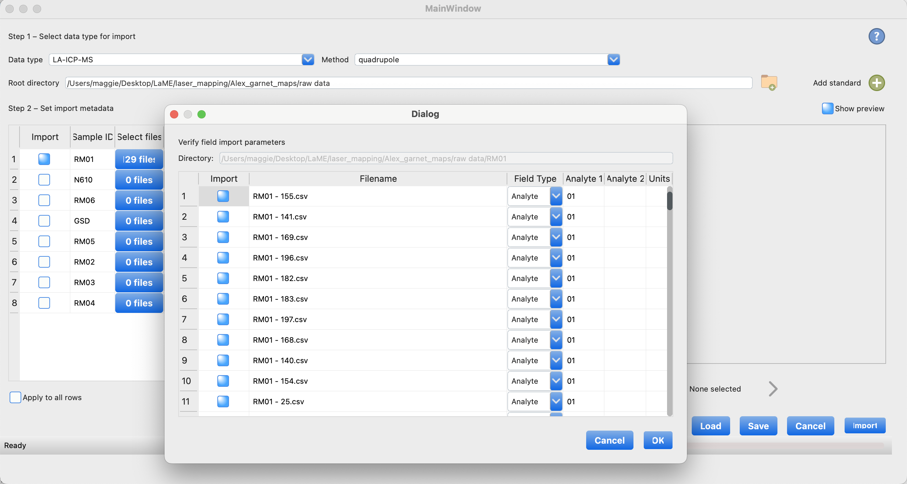

Import Formats
**************

Import formats vary by data type, and can differ based on machine manufacturer or the program used to processes the data.  This section describes the supported formats and the import process.  If you have a file type that is not included, feel free to :doc:`contact us <contact>` to see if we can write a method to suit your particular needs.

Currently, *LaME* primarily handles LA-ICP-MS data, with plans to include additional data types in future updates.

Using the Import Tool
=====================

Importing data into *LaME* is straightforward using the *Import Tool* from the *Main Toolbar* (|icon-import-directory|). Here's an overview of the process:

1. Select the data type and method (if applicable) from the dropdown menus
2. Choose the directory containing the sample files - each sample should be in its own subdirectory
3. Select the analytes for each sample (all analytes are selected by default)
4. Review your settings and click "Import" to process the data

After import, files for each sample are saved into a single file for more rapid loading, with the name format *[sample_id].lame.[ftype]*.  In most cases, the file type is \*.csv, though in some instances where color is appropriate, it may be stored as a \*.png.

    The *Import Tool* interface, shown importing LA-ICP-MS data.

Supported Data Formats
======================

LA-ICP-MS
---------

LA-ICP-MS data can be imported using different methods based on the mass spectrometer type and data format:

Quadrupole
^^^^^^^^^^

For a single sample, the data are often stored in a collection of \*.csv or \*.xlsx files.  *LaME* can read two formats, which it attempts to autodetect from the filename patterns.  While its ability to handle filename formats are limited, it will probably handle most reasonable naming schemes.  In both cases the collection of files should be stored in a directory given by the sample ID.  Once read in, the data are exported in a single file, common data format with a *.lame.csv* suffix and extension.

For data collected on quadrupole mass spectrometers, the only requirement for import is the sample ID.  The columns in the table are as follows:

:Import: checkbox indicating whether to include the directory for import.
:Sample ID: sample identifier and name of the directory which holds the files associated with the sample.
:Select files: opens the Analyte Selection dialog to choose which analytes to import for each sample.
:Standard: select the standard used to calibrate the data or standard to calibrate the data (once we implement calibration).  Note additional calibration files may be added to the standard list.  Standards analyses should follow similar file naming conventions as described below.
:Scan axis: the direction of the scan lines, either *X* or *Y*.
:Swap XY: swap the *X* and *Y* dimensions.
:X reverse: reverse the direction of the *X* data.
:Y reverse: reverse the direction of the *Y* data.
:Spot size (µm): laser spot size, used to determine distance between scan lines.
:Sweep (s): time to complete a full suite of analytes.
:Speed (µm/s): rate of travel of the laser.

For data collected on quadrupole mass spectrometers, the requirement for import is the sample ID. The distance along the scan line is given by *sweep* \* *speed*. If these parameters are not entered, then the pixels are assumed to be equidimensional (i.e., *dx* = *dy*). These parameters can be updated after uploading in the *dx* and *dy* edit fields of the *Sample and Fields* tab.

*LaME* supports two common file formats for quadrupole data:

1. Scan Line Format
^^^^^^^^^^^^^^^^^^^

Files include all recorded analytes for a single scan line in each individual file.  This file format is typically used for raw data in CPS. Filenames for this format often include a sample number and a line number separated by a delimiter.  These can come in any order and a variety of delimiters may used.  *LaME* strips away these common elements to identify the line numbers.

Example filenames include:  

- RM03-3.csv
- RM05 - 10.csv
- TR3-06-1.csv
- M252-m1 - 6.csv
- 90-75B-PY-3.csv
- 121.csv

In all but the last two cases above, the line number came last.  However, the order doesn't matter as *LaME* will strip away the common patterns to reveal the line number, which it needs along with spot size to determine distance between lines.  This distance is defined as the *X*-direction.

Each file should include several metadata lines followed by a header and the table of values with results from each analyte in a separate column.  The first column is the time along the line.  The difference in times are the sweep time and should be constant from measurement to measurement.  The sweep time along with the rate of travel of the laser is used to determine the distance along the line.  This distance is the *Y*-direction.  A snippet is shown in the table below, with the first three lines removed.  These three lines do not provide metadata useful to *LaME*.

 .. csv-table:: Scan-line file from LA-ICP-MS quadrupole
    :file: _static/tables/la-icp-ms_line_snippet.csv
    :widths: 11 11 11 11 11 11 11 11 11
    :header-rows: 1

.. note:: 
   Scan line data may include files with standards.  These standards will sit between scan lines of the sample resulting in non-sequential line numbers for the sample, which is accounted for by *LaME* when converting to distance.

2. Matrix Format
^^^^^^^^^^^^^^^^

An alternative format reports each analyte in a separate file as a matrix (map-form) and may be produced after calibration and/or processing in Iolite or XMapTools, generally used to report data in PPM, though they may still be in CPS.  The filenames are generally constructed from the sample name and the analyte and often include the units and matrix, though the only important component is the analyte, which is use to define the column in the output data.  The order of the mass and symbol can be either mass first or mass last conventions.

Example filenames:

- 23Na.csv
- RM03 Dy163_ppm matrix.csv
- 4337064_grt03 Ba137_CPS matrix.csv
- B10B_SMALL_ppm K39_ppm matrix.csv
|
Each file should include a matrix of data without headers, line numbers, distances, or times.  The default reads columns as the *X* coordinate and rows as the *Y*.  A snippet is shown in the table below.

 .. csv-table:: Analyte-matrix file from LA-ICP-MS quadrupole
    :file: _static/tables/la-icp-ms_matrix_snippet.csv
    :widths: 16 17 16 17 16 17
    :header-rows: 0

Other Data Types (Coming Soon)
==============================

The following data types and formats are planned for future implementation:

- TOF (HDF5)
- MLA
- XRF (\*.png, \*.tif)
- SEM
- CL
- Petrography (\*.png, \*.jpg, \*.tif)

