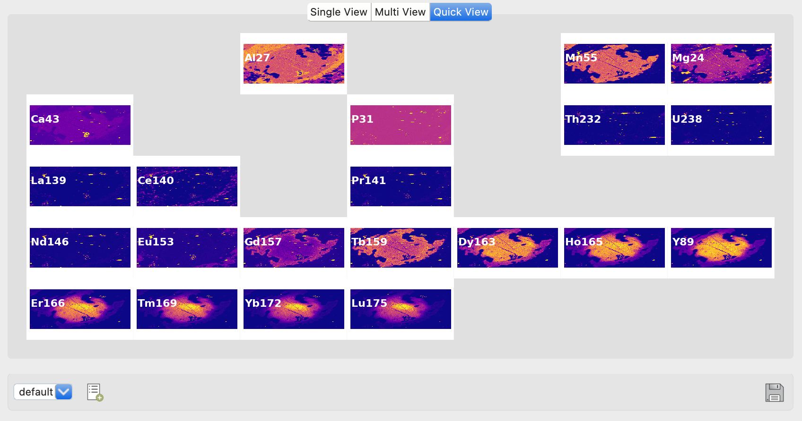

.. Laser Map Explorer documentation master file, created by
   sphinx-quickstart on Tue Mar 12 12:36:10 2024.
   You can adapt this file completely to your liking, but it should at least
   contain the root `toctree` directive.
.. sphinx-build -b html docs/source/ docs/build/html
.. raw:: html

   

Welcome to Laser Map Explorer (*LaME*)!
***************************************

Laser Map Explorer (*LaME*) is an innovative software tool developed by researchers in the University of Adelaide, Earth Sciences Department.  The work is supported by the MinEx CRC.  *LaME* is designed for processing and visualizing multi-analyte maps of minerals, whether it be LA-ICP-MS maps of isotopes, XRF maps of elements, or some other imaging method. The software aims to simplify the complex task of handling large volumes of map-form data via an intuitive graphical user interface.

Key Features:

* Simple and quick data filtering
* Standard geochemical plot production
* Multi-dimensional analyses
* Computations relevant to geoscientific interpretation
* Creation of publication-ready figures
* Rapid production of supplemental information

The program is currently in beta release.  There are plenty of bugs and some features that have yet to be partially or fully implemented.  Release notes below detail the progress and future plans.

.. toctree::
   :maxdepth: 1
   :caption: Contents:

   userguide
   tutorials
   documentation
   contact

Release notes:
==============

As *LaME* is currently in beta, there are still some features that need to be completed/fixed.  Most plot functions are working.  Analyte maps, noise reduction, scatter and heatmaps, PCA and clustering are all working properly.  Histograms and correlation plots are also working.  Most plot types can be customized by selecting/filtering the data.  Masking and filtering are functional, but have not been extensively tested.  Profiling works, but is not yet displayed in an easy to customize format.  There are a few buttons that have planned functionality, but have yet to be implemented wholly or in part.  Note taking functions, figure saving, spot data, and the custom field calculator are places where functionality are not at 100%.  

*LaME*'s documentation can be accessed through the help browser in the bottom dock.  Since the documentation is integrated with the program it should be viewable when offline.  The documentation is not yet complete.

If you aren't a fan of the name, pronounce it in French as the word lamé.

Known issues:
=============

We can use your help to identify bugs, places where the program is not intuitive, and/or layout can be improved.  We would also like to know what new features you would like to see implemented.  For instance, are there types of analyses, plots, or auto-generated note capabilities that you might like to see?

Check the `GitHub Issues <https://github.com/dhasterok/LaserMapExplorer/issues>`_ page for a current list of documented issues and feature requests.

If you would like to contribute in any way to the improvement of the program, have feature requests or would like to help with documentation, please contact us via the GitHub project page or using the email link on the :doc:`contact` page.

Funding for this app has been provided by the `MinEx CRC <https://minexcrc.com.au/>`_ by developers at the `University of Adelaide <https://www.adelaide.edu.au/>`_.