Left Toolbox
************

The left toolbox includes the controls for changing and processing samples, producing plots, and performing analyses.  A list of plot types and where they are generated is given below.

+---------------------------+---------------------------+
| Plot type                 | Tab                       |
+===========================+===========================+
| map                       |                           |
+---------------------------+---------------------------+
| - linear                  | *Plot selector*           |
| - log                     |                           |
| - normalized              |                           |
| - ternary colored map     | *Scatter and Heatmaps*    |
| - PCA score map           | *PCA*                     |
| - Cluster map             | *Clustering*              |
| - Cluster score map       |                           |
+---------------------------+---------------------------+
| correlation               |                           |
+---------------------------+---------------------------+
| - Pearson                 | *Samples and Fields*      |
| - Spearmann               |                           |
| - Kendall                 |                           |
+---------------------------+---------------------------+
| histogram                 |                           |
+---------------------------+---------------------------+
| - normal                  | *Preprocessing*           |
| - KDE                     |                           |
+---------------------------+---------------------------+
| biplot                    |                           |
+---------------------------+---------------------------+
| - scatter                 | *Scatter and Heatmaps*    |
| - 2-D histogram (heatmap) |                           |
+---------------------------+---------------------------+
| ternary                   |                           |
+---------------------------+---------------------------+
| - scatter                 | *Scatter and Heatmaps*    |
| - heatmap                 |                           |
+---------------------------+---------------------------+
| multidimensional          |                           |
+---------------------------+---------------------------+
| - TEC (spider)            | *n-Dim*                   |
| - radar                   |                           |
+---------------------------+---------------------------+
| PCA                       |                           |
+---------------------------+---------------------------+
| - explained variance      | *PCA*                     |
| - vector heatmap          |                           |
| - score X vs. score Y     |                           |
| - score map               |                           |
+---------------------------+---------------------------+
| cluster map               | *Clustering*              |
+---------------------------+---------------------------+
| geochemistry profile      | *Profiling*               |
+---------------------------+---------------------------+

Samples and Fields
==================

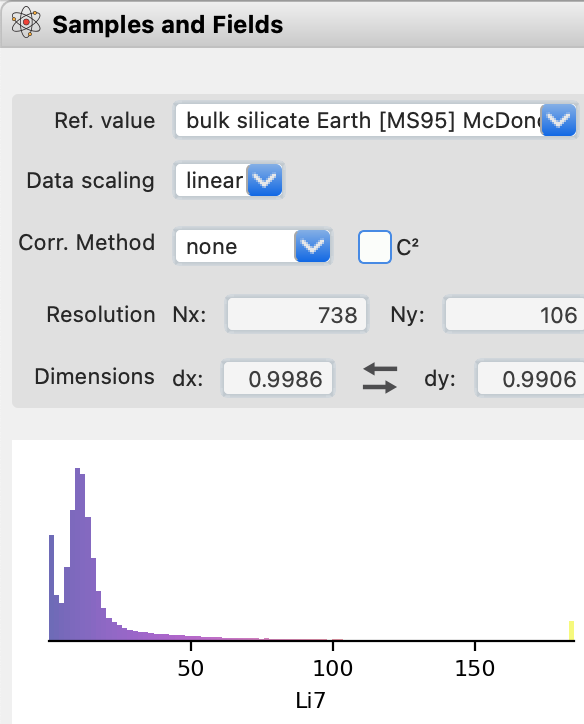

    The *Samples and Fields* tab contains tools for choosing analytes and plotting correlations.

Change sample:

* prompt to save analysis - saves to disk
* clears polygons, profiles, delete filters in table

Crop or reset map extent:

* resets data
* recompute clipped and analysis data
* deletes all figures
* clears masks, polygons, profiles and special function calculations
* refilters the data based on existing filters
* recomputes calculated fields

Swap X-Y:

* swaps x-y coordinates on maps, polygons and profiles
* recomputes maps

Change Analytes:

* updates *Plot Selector*
* clear clusters, pca, removes masks
* recompute correlations

Change ref value:

* update anything with norm data (plots, calculated fields, n-Dim plots, clustering?, filters?)

Change data scaling:

* same as crop and clears filters

Change Correlation Method:

* update correlation plots

.. _preprocessing
Preprocess
==========

Preprocessing, alters the data to improve performance, stability and visual characteristics.  

These changes can have an impact on certain statistical calculations, such as mean values and standard deviations.  

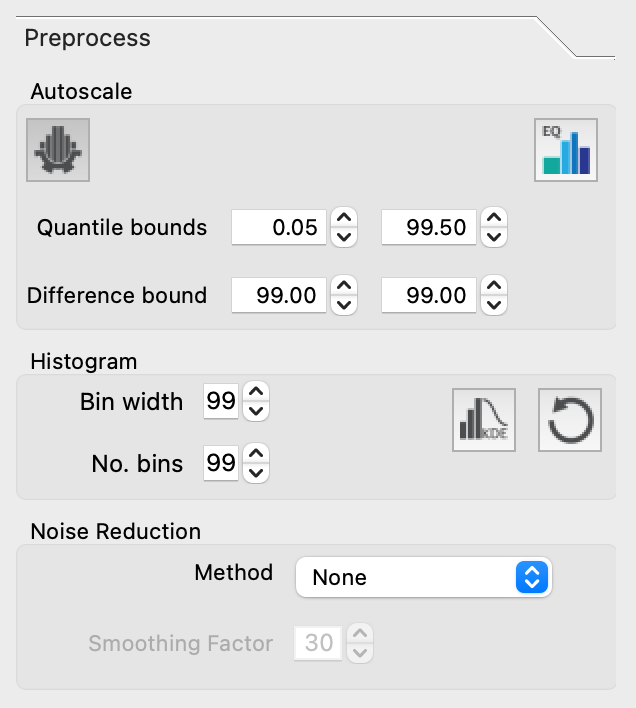

    The *Preprocessing* tab contains tools for autoscaling histograms, equalization, and noise reduction.

Autoscaling |icon-autoscale|
----------------------------

One common calibration issue is the conversion of low counts to negative concentrations after calibration.  These are almost certainly due to difference between the ablation properties of the mineral used to calibrate the map applied and another mineral.  Negative values are particularly an issue when the data are log-scaled.  To reduce the effect of negatives, we rescale the data by bringing applying a linear compression of the data, fixing the upper end and moving the lower end to a small positive value.  While this does change the concentration, it has a small affect on large concentrations.  We also perform an autoscaling, performed by default, to clip the high and low ends of the concentrations.  These values are not removed, rather set to the top or bottom of the scale.  Autoscaling can skew statistics as a result; however, it generally improves estimates of the mean as values that are several orders of magnitude higher than reasonable no longer have a massive effect.  Autoscaling can be toggled on or off by pressing the |icon-autoscale| button. 

Histogram Equalization
----------------------

An alternative to auto scaling that does not alter the data, histogram equalization ( |icon-histeq| ) ensures that colors are assigned by equal quantiles.  This method is particularly useful when the histogram covers a relatively large range of values often bi- or multi-modal with large regions of few data between.  A potential disadvantage is an amplification of noise at the expense of real features.

Histograms
----------

Noise Reduction
---------------

Noise reduction ( |icon-noise-reduction| ) involves the smoothing of data.  It may be applied to maps only for viewing, or can be applied to *Analysis Data* before producing other plots and analyses (set from the *Apply to analysis* drop down).  There are four noise reduction methods available:

* median, smooths the data by computing the median value over a specified kernel (window) size, assigning the result to the center pixel. The results smooth across the entire image;
* Gaussian, smooths the data using a Gaussian weighting with a specified sigma computed over a specified kernel size, assigning the result to the center pixel. The results smooth across the entire image;
* Wiener, smooths the data using a Fourier domain low-pass filter;
* edge-preserving, smooths the data while preserving sharp edges, this is the suggested option for most cases, though it may oversmooth inside grains; and
* bilateral, Gaussian smoothing and edge-preserving, this filter differs from edge-preserving as it does not as strongly smooth the data.

Spot Data
=========

Spot data is not currently available.

.. figure:: _static/screenshots/LaME_Spot_Data.png
    :align: center
    :alt: LaME interface: left toolbox, preprocessing tab
    :width: 315

    The *Spot Data* tab contains tools for loading and displaying and analyzing spot data.

Filter
======

There are three types of filters than can be applied to exclude data from analyses and geochemical plots.  These include filters by value ( |icon-filter2| ), polygon masking ( |icon-polygon-new| ), and cluster masking ( |icon-mask-dark| ).  Filter by value and polygon masking are both created from the *Filter* tab whereas the cluster mask is set from *Styling\>Clusters* in the right toolbox.  It is possible to use any combination of these filters and masks and turn them on or off as required.  All filters and masks can be turned off by clicking the |icon-map| button.

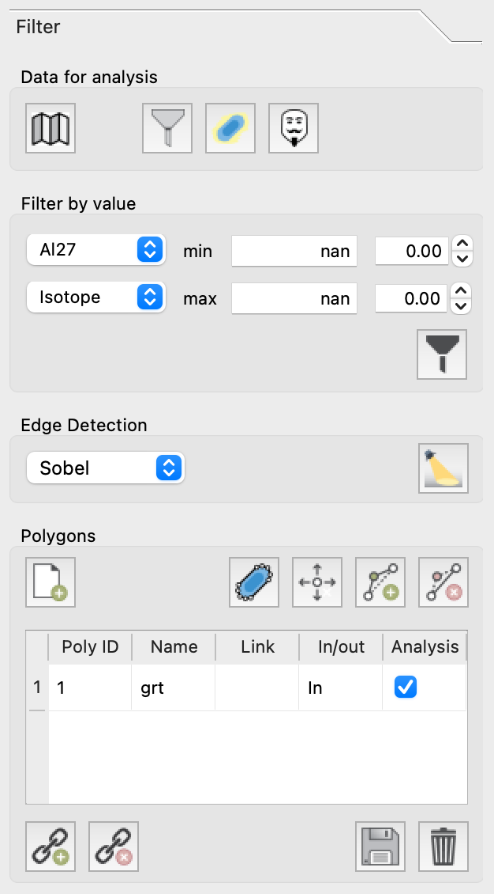

    The *Filter* tab contains tools for filtering by value creating polygons.  It also contains an edge detection algorithm, useful for creating polygons.

Filter by value |icon-filter2|
--------------------------------

To set a filter, use the two drop down menus to select the type of field (lower) and the desired field (upper).  It is possible to filter by value using element/isotopes, ratios, custom fields, principal component score, or cluster score.  Once selected, the ranges for the field will be automatically displayed in the min and max boxes.  Change the values to set the bounds explicitly using the (left boxes) or implicitly by setting the quantile bounds (right boxes).  Once the bounds are set, click the |icon-filter2| button to add the filter to the list.

Multiple filters may be combined to produce more complex filters.  The filters include a boolean operations (*and* and *or*, set in the *Filter Table* in the `lower pane`_) to assist with precisely defining filters to capture the desired regions for analysis and plotting.  In many cases, the overlap between values may make it difficult to separate phases.  In these cases, we suggest targeting specific regions with a polygon or cluster mask.

Polygon Masking |icon-polygon-new|
----------------------------------

to create a polygon for filtering, select a map from the plot selector and then click the |icon-polygon-new| button.  Move the mouse over the map and left-click to add vertices.  You will notice a zoom tool appears that shows a small region of the map where the mouse is located.  Once you have added enough points, right-click on the map to end digitizing.  A polygon will appear in the *polygon table*, where a name can be added.  Once created, polygons can be edited.  Move a point by clicking the |icon-move-point| button, then left-click on the map near the point to be moved and then left-click again for the new location.  Add a vertex by clicking the button |icon-add-point| and selecting the line segment where you wish to add a point.  Then click where you would like the new point.  To remove points, click the button |icon-remove-point| and then click the point you wish to remove.

It is possible to create multiple polygons.  These polygons can be analyzed as separate regions or linked by selecting multiple polygons in the *Polygon Table* and clicking the |icon-link| button.  To delink the polygons, select the polygon in the table and then click the |icon-unlink| button.  The use of individual polygons in analyses can be toggled by clicking the associated checkbox in the *Polygon Table*.

The polygons within the table can be stored by clicking the |icon-save| button and recolled using the |icon-open-file| button.  See a description of `file specifications`_ for more information.

Cluster Masking |icon-mask-dark|
--------------------------------

Cluster masks can be turned on or off from the *Filter* tab, but cannot be set here.  To set a cluster mask, you will need to 

#. compute clusters first from the *Cluster* pane in the left toolbox
#. from the *Styling* tab on the right pane, select the *Clusters* sub-tab and choose the type of clustering from the point grouping drop down
#. select the cluster(s) that you wish to mask and click the |icon-mask-dark| button to set the cluster mask or
#. alternatively, select the clusters you wish to use for analysis and click the |icon-mask-light| button to set the other groups as the mask.

Edge-detection
--------------
To aid with the identification of mineral boundaries, you can turn on edge detection by clicking the |icon-edge-detection| button. There are multiple edge detection methods available (Sobel, Canny, zero-cross) which you can select using the dropdown menu.  Edge-detection is useful for locating the boundaries of polygons.  The use of edge detection does not affect analyses.

Scatter and Heatmaps
====================

The creation of 

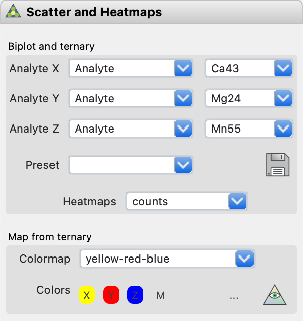

    The *Scatter and Heatmaps* tab contains tools for plotting scatter maps and heat maps in 2 (biplots) and 3 (ternary) dimensions.  Scatter data may be colored by a field set in the *Styling* tab.  A map may also be produced with color defined by pixel position within a ternary diagram.

n-Dim
=====

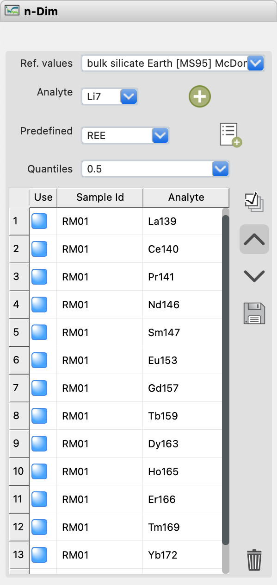

    The *n-Dim* tab contains tools for plotting multidimensional data as either radar plots or trace element compatibility diagrams (a.k.a. spider diagrams).

This tab is used to produce trace element compatibility diagrams (spider plots) with data normalized to a set of reference concentrations.  This tab is also used to produce radar plots (that look more like spider webs).

Principal Component Analysis (PCA)
==================================

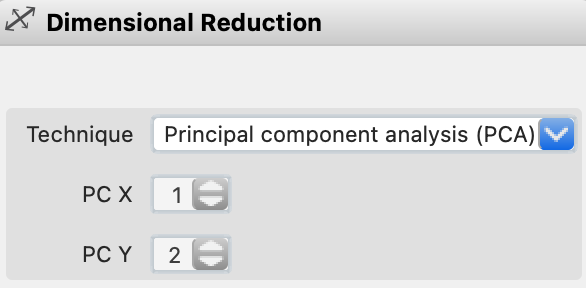

    The *PCA* tab contains tools for displaying a variety of plots relevant to principal component analysis, inclucing maps of PCA dimension scores.

Select from a range of plots relevant to principal component analyses using the *Plot type* dropdown, including: 

* variance - individual and cumulative explained variance for the principal components
* vectors - a heatmap showing vector components, useful for observing the influence of input fields on the variance (spread) in the data along each principal component axis
* 2-D score plots - shows both the scores of individal data points along two principal component axes (*PC X* and *PC Y*) and the field components along each axis
* score maps - produces a score map for a single principal component, change the map by changing the value of *PC X* field.

2-D score plots can also be displayed as a scatter or heatmap by selecting the corresponding from the *Plot type* dropdown.  

To save to the plot tree by clicking the |icon-launch| button.

Clustering
==========

Clustering employs unsupervised machine learning to identify subsets of the data that contain similar characteristics in multidimensional space (i.e., similar geochemical characteristics).  It is often a more efficient way to filter data when the goal is to isolate or exclude specific minerals from analyses.  Two methods are currently implmented, k-means and fuzzy c-means, which are chosen from the *Method* dropdown.  The simpler of the two algorithm is k-means, which optimizes the centroids of clusters by minimizing the distance of points nearest to each respective centroid.  Fuzzy c-means differs in that it assumes that the clusters can overlap allowing for an additional score to be provided for each cluster in addition to map assigning each point to the cluster with the highest score.

.. figure:: _static/screenshots/LaME_Clustering.png
    :align: center
    :alt: LaME interface: left toolbox, clustering tab
    :width: 315

    The *Clustering* tab contains tools for calculating and displaying multianalyte data classified into clusters based on similarities in properties.  Clustering needs to be performed prior to creating a cluster mask.

Profiling
=========

Create profiles across the across the map.
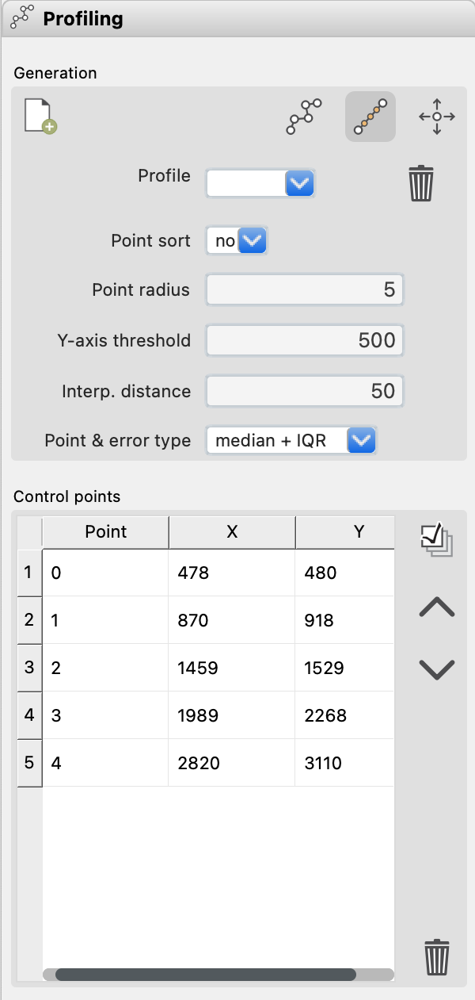

    The *Profiling* tab contains tools for creating cross sections of analytes across the maps.

Special Functions
=================

These are not yet implemented, but will include methods to compute thermometry, barometry, dating using various isotopic systems, and multicomponent diffusion.  If you have interest in applying a specific methods please contact us and we'll see what we can do.

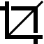

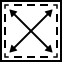

.. |icon-autoscale| image:: _static/icons/icon-autoscale-64.png
    :height: 2ex

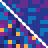

.. |icon-map| image:: _static/icons/icon-map-64.png
    :height: 2ex

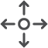

.. |icon-filter| image:: _static/icons/icon-filter-64.png
    :height: 2ex

.. |icon-link| image:: _static/icons/icon-link-64.png
    :height: 2ex

.. |icon-unlink| image:: _static/icons/icon-unlink-64.png
    :height: 2ex

.. |icon-mask-light| image:: _static/icons/icon-mask-light-64.png
    :height: 2ex

.. |icon-mask-dark| image:: _static/icons/icon-mask-dark-64.png
    :height: 2ex

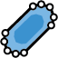

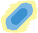

.. |icon-launch| image:: _static/icons/icon-launch-64.png
    :height: 2ex