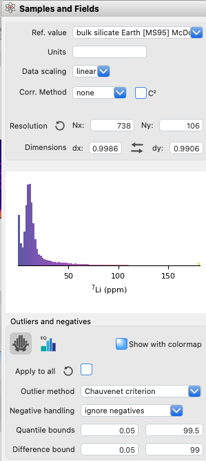

Control Toolbox (Left)
**********************

The Control Toolbox provides essential functions for data management, analysis, and visualization. 

Samples and Fields
==================

The Samples and Fields tab offers crucial functions for data management.  Here, reference values can be changed, which updates normalized data across plots, calculated fields, n-Dim plots, clustering, and filters.  Modifying data scaling is similar to cropping and clears existing filters, so this option should be used judiciously.  Additionally, the correlation method can be adjusted, which automatically updates all correlation plots to reflect the chosen approach.

    Samples and Fields tab with options for data manipulation and correlation visualization.

Autoscaling
-----------

Autoscaling (|icon-autoscale|) addresses a common calibration issue where low counts convert to negative concentrations after calibration.  This often results from differences in ablation properties between calibration and sample minerals, causing particular problems with log-scaled data.  To mitigate this, *LaME* applies a linear compression to the data, fixing the upper end and shifting the lower end to a small positive value.  While this alters concentrations slightly, it minimally affects larger values.  The autoscaling process, performed by default, clips extreme high and low concentrations to the scale's limits.  Although autoscaling can influence statistics, it generally improves mean estimates by reducing the impact of unreasonably high values. 

Histogram Equalization
----------------------
Histogram equalization (|icon-histeq|) offers an alternative to autoscaling that preserves the original data.  This method assigns colors based on equal quantiles, proving particularly useful for datasets with wide value ranges or multi-modal distributions. While effective for visualizing complex distributions, be aware that it may amplify noise at the expense of real features.

.. figure:: _static/screenshots/LaME_Preprocess.png
    :align: center
    :alt: LaME interface: left toolbox, preprocessing tab
    :width: 315

    Preprocessing tab with tools for data enhancement and noise reduction.

Preprocess
==========

The Preprocessing tab provides tools for data enhancement and noise reduction. Preprocessing alters the data to improve performance, stability, and visual characteristics. Note that these changes can impact certain statistical calculations, such as mean values and standard deviations.

.. figure:: _static/screenshots/LaME_Preprocess.png
    :align: center
    :alt: LaME interface: left toolbox, preprocessing tab
    :width: 315

    Preprocessing tab with tools for data enhancement and noise reduction.

Noise Reduction
---------------

Noise reduction (|icon-noise-reduction|) smooths data to enhance clarity.  It can be applied solely to maps for viewing or to Analysis Data before generating plots and analyses.  The application method can be selected from the Method dropdown. *LaME* offers five noise reduction methods:

* Median: Computes the median value over a specified kernel size, smoothing across the entire image.
* Gaussian: Applies Gaussian weighting over a specified kernel size, smoothing across the entire image.
* Wiener: Utilizes a Fourier domain low-pass filter for smoothing.
* Edge-preserving: Smooths data while maintaining sharp edges, recommended for most cases but may over-smooth within grains.
* Bilateral: Combines Gaussian smoothing with edge preservation, offering less aggressive smoothing than the edge-preserving method.

Histogram
---------

The Histogram tool produces visualizations of data distribution.  The presentation of the histogram can be adjusted by modifying either the bin width or the number of bins.  Changing the bin width automatically updates the number of bins, and vice versa.  This flexibility enables fine-tuning of the histogram to best represent the data distribution.

Spot Data
=========

Spot data functionality is currently under development and not available.

.. figure:: _static/screenshots/LaME_Spot_Data.png
    :align: center
    :alt: LaME interface: left toolbox, spot data tab
    :width: 315

    Spot Data tab (functionality not currently available).

Polygons
========

The Polygons tab allows you to create and edit polygons for data filtering and selection.  To create a polygon, first select a map from the *Plot Selector*.  Then, click the |icon-polygon-new| button in the Polygons tab.  Left-click on the map to add vertices, and a zoom tool will appear for precision.  Right-click to finish the polygon.  The newly created polygon can be named in the Polygon Table.

Existing polygons can be modified using several editing tools.  To move a point, select the |icon-move-point| tool, left-click near the point to be moved, then left-click again at the desired new location.  For adding a new vertex to an existing polygon, use |icon-add-point| tool and click on a line segment of the polygon, then click where the new point should be added.  If a point needs to be removed, simply select the |icon-remove-point| tool, then click on the point to be deleted from the polygon.

    Polygons tab with tools for creating polygons across maps.

Profiling
=========

The Profiling tab enables the creation of cross-sections of analytes across maps, allowing for detailed analysis of compositional changes along specific paths in the sample.

.. figure:: _static/screenshots/LaME_Profiling.png
    :align: center
    :alt: LaME interface: left toolbox, profiling tab
    :width: 315

    Profiling tab with tools for creating cross-sections of analytes across maps.

Scatter and Heatmaps
====================

The Scatter and Heatmaps tab provides tools for creating scatter plots and heatmaps in both 2D (biplots) and 3D (ternary) dimensions.  Scatter data can be colored by a field set in the Colormap dropdownlist, allowing for multi-variable visualization. Additionally, maps can be generated with colors defined by pixel positions within a ternary diagram, offering a unique perspective on three-component systems.

.. figure:: _static/screenshots/LaME_Scatter_and_Heatmaps.png
    :align: center
    :alt: LaME interface: left toolbox, scatter and heatmaps tab
    :width: 315

    Scatter and Heatmaps tab for creating various 2D and 3D visualizations.

n-Dim
=====

The n-Dim tab is used for plotting multidimensional data as radar plots or trace element compatibility diagrams (spider plots).  This tab allows for the production of spider plots with data normalized to a set of reference concentrations, as well as radar plots that resemble spider webs, offering versatile options for visualizing complex, multi-element data.

.. figure:: _static/screenshots/LaME_n-Dim.png
    :align: center
    :alt: LaME interface: left toolbox, n-Dim tab
    :width: 315

    n-Dim tab for creating multidimensional plots like spider diagrams and radar plots.

Dimensional Reduction
=====================

The Dimensional Reduction tab offers tools for principal component analysis (PCA) visualization, a key technique for reducing the dimensionality of complex datasets.

.. figure:: _static/screenshots/LaME_PCA.png
    :align: center
    :alt: LaME interface: left toolbox, PCA tab
    :width: 315

    Dimensional Reduction tab with tools for principal component analysis visualization.

Clustering
==========

The Clustering tab employs unsupervised machine learning to identify data subsets with similar multidimensional characteristics.  This functionality is often used to isolate or exclude specific minerals from analyses.  *LaME* implements two clustering methods:

1. K-means: A method that optimizes cluster centroids by minimizing the distance of nearest points to each centroid.
2. Fuzzy c-means: An approach that allows for overlapping clusters, providing an additional score for each cluster alongside the map and assigning each point to the highest-scoring cluster.

The number of clusters can be specified using the 'No. clusters' field. For fine-tuning the clustering process, an 'Exponent' value can be adjusted using a slider when fuzzy c-means is selected, and the 'Distance' metric can be chosen from a dropdown menu.  To ensure reproducibility of results, a 'Starting seed' can be set.  The interface also provides options to incorporate Principal Component Analysis (PCA) and a 'No. basis' field for specifying the number of components to use.  These options provide users with flexibility in how clustering is performed, allowing for customization based on the specific requirements of the data being analyzed.  Note that clustering must be performed before creating a cluster mask.

.. figure:: _static/screenshots/LaME_Clustering.png
    :align: center
    :alt: LaME interface: left toolbox, clustering tab
    :width: 315

    Clustering tab for multivariate data classification and analysis.

P-T-t Functions
===============

P-T-t Functions for computing thermometry, barometry, isotopic dating, and multicomponent diffusion are planned for future implementation. 

.. |icon-crop| image:: _static/icons/icon-crop-64.png
    :height: 2.5ex

.. |icon-fit-to-width| image:: _static/icons/icon-fit-to-width-64.png
    :height: 2.5ex

.. |icon-autoscale| image:: _static/icons/icon-autoscale-64.png
    :height: 2.5ex

.. |icon-histeq| image:: _static/icons/icon-histeq-64.png
    :height: 2.5ex

.. |icon-noise-reduction| image:: _static/icons/icon-noise-reduction-64.png
    :height: 2.5ex

.. |icon-map| image:: _static/icons/icon-map-64.png
    :height: 2.5ex

.. |icon-edge-detection| image:: _static/icons/icon-spotlight-64.png
    :height: 2.5ex

.. |icon-move-point| image:: _static/icons/icon-move-point-64.png
    :height: 2.5ex

.. |icon-add-point| image:: _static/icons/icon-add-point-64.png
    :height: 2.5ex

.. |icon-remove-point| image:: _static/icons/icon-remove-point-64.png
    :height: 2.5ex

.. |icon-filter| image:: _static/icons/icon-filter-64.png
    :height: 2.5ex

.. |icon-filter2| image:: _static/icons/icon-filter2-64.png
    :height: 2.5ex

.. |icon-link| image:: _static/icons/icon-link-64.png
    :height: 2.5ex

.. |icon-unlink| image:: _static/icons/icon-unlink-64.png
    :height: 2.5ex

.. |icon-mask-light| image:: _static/icons/icon-mask-light-64.png
    :height: 2.5ex

.. |icon-mask-dark| image:: _static/icons/icon-mask-dark-64.png
    :height: 2.5ex

.. |icon-polygon-new| image:: _static/icons/icon-polygon-new-64.png
    :height: 2.5ex

.. |icon-polygon-off| image:: _static/icons/icon-polygon-off-64.png
    :height: 2.5ex

.. |icon-launch| image:: _static/icons/icon-launch-64.png
    :height: 2.5ex
