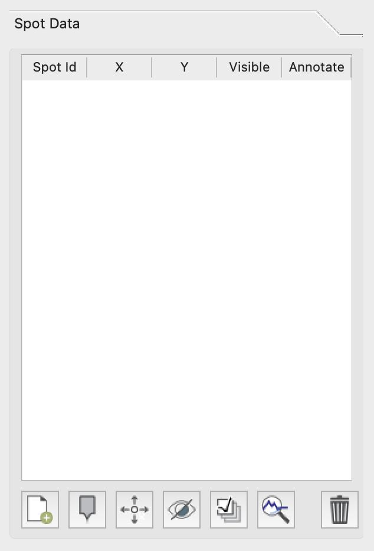
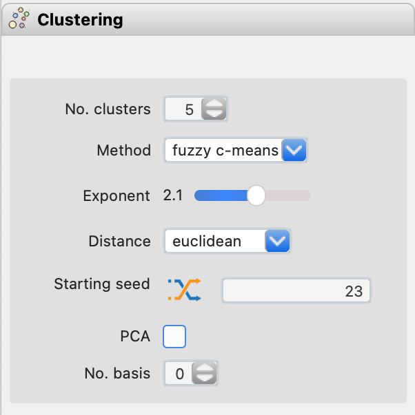

Control Toolbox (Left)
**********************

Samples and Fields
==================

.. figure:: _static/screenshots/LaME_Samples_and_Fields.png
    :align: center
    :alt: LaME interface: left toolbox, samples and fields tab
    :width: 315

    Samples and Fields tab with options for data manipulation and correlation visualization.

The Samples and Fields tab offers crucial functions for data management. Here, you can change reference values, which updates normalized data across plots, calculated fields, n-Dim plots, clustering, and filters. Modifying data scaling is similar to cropping and clears existing filters, so use this option judiciously. Additionally, you can adjust the correlation method, which automatically updates all correlation plots to reflect your chosen approach.

Autoscaling |icon-autoscale|
----------------------------

Autoscaling addresses a common calibration issue where low counts convert to negative concentrations after calibration. This often results from differences in ablation properties between calibration and sample minerals, causing particular problems with log-scaled data.

To mitigate this, *LaME* applies a linear compression to the data, fixing the upper end and shifting the lower end to a small positive value. While this alters concentrations slightly, it minimally affects larger values. The autoscaling process, performed by default, clips extreme high and low concentrations to the scale's limits.

Although autoscaling can influence statistics, it generally improves mean estimates by reducing the impact of unreasonably high values. Toggle autoscaling on or off using the |icon-autoscale| button.

Histogram Equalization
----------------------

Histogram equalization (|icon-histeq|) offers an alternative to autoscaling that preserves the original data. This method assigns colors based on equal quantiles, proving particularly useful for datasets with wide value ranges or multi-modal distributions. While effective for visualizing complex distributions, be aware that it may amplify noise at the expense of real features.

.. figure:: _static/screenshots/LaME_Preprocess.png
    :align: center
    :alt: LaME interface: left toolbox, preprocessing tab
    :width: 315

    Preprocessing tab with tools for data enhancement and noise reduction.

Preprocess
==========

.. figure:: _static/screenshots/LaME_Preprocess.png
    :align: center
    :alt: LaME interface: left toolbox, preprocessing tab
    :width: 315

    Preprocessing tab with tools for data enhancement and noise reduction.

Preprocessing alters the data to improve performance, stability, and visual characteristics. Note that these changes can impact certain statistical calculations, such as mean values and standard deviations.

Noise Reduction
---------------

Noise reduction (|icon-noise-reduction|) smooths data to enhance clarity. You can apply it solely to maps for viewing or to Analysis Data before generating plots and analyses. Select the application method from the 'Apply to analysis' dropdown. LaME offers five noise reduction methods:

* Median: Computes the median value over a specified kernel size, smoothing across the entire image.
* Gaussian: Applies Gaussian weighting over a specified kernel size, smoothing across the entire image.
* Wiener: Utilizes a Fourier domain low-pass filter for smoothing.
* Edge-preserving: Smooths data while maintaining sharp edges, recommended for most cases but may over-smooth within grains.
* Bilateral: Combines Gaussian smoothing with edge preservation, offering less aggressive smoothing than the edge-preserving method.

Histograms
----------

The Histogram tool produces visualize the distribution of your data. You can adjust the presentation of your histogram by modifying either the bin width or the number of bins. Changing the bin width automatically updates the number of bins, and vice versa. This flexibility enables you to fine-tune histogram to best represent the data distribution.

Spot Data
=========

    Spot Data tab (functionality not currently available).

Spot data functionality is currently under development and not available.

Polygons
========

The Polygons tab allows you to create and edit polygons for data filtering and selection. Follow these steps to create a polygon:

1. Select a map from the plot selector.
2. Click the |icon-polygon-new| button in the Control Toolbox.
3. Left-click on the map to add vertices. A zoom tool will appear for precision.
4. Right-click to finish the polygon.
5. Name your new polygon in the Polygon Table.

To edit existing polygons:
- To move a point: Click |icon-move-point|, then left-click near the point and again at its new location.
- To add a vertex: Click |icon-add-point|, select a line segment, and click where you want to add the point.
- To remove a point: Click |icon-remove-point| and then click the point you wish to remove.

.. figure:: _static/screenshots/LaME_Polygons.png
    :align: center
    :alt: LaME interface: left toolbox, profiling tab
    :width: 315

    Polygons tab with tools for creating polygons across maps.

Profiling
=========

.. figure:: _static/screenshots/LaME_Profiling.png
    :align: center
    :alt: LaME interface: left toolbox, profiling tab
    :width: 315

    Profiling tab with tools for creating cross-sections of analytes across maps.

The Profiling tab enables you to create cross-sections of analytes across maps, allowing for detailed analysis of compositional changes along specific paths in your sample.

Scatter and Heatmaps
====================

.. figure:: _static/screenshots/LaME_Scatter_and_Heatmaps.png
    :align: center
    :alt: LaME interface: left toolbox, scatter and heatmaps tab
    :width: 315

    Scatter and Heatmaps tab for creating various 2D and 3D visualizations.

The Scatter and Heatmaps tab provides tools for creating scatter plots and heatmaps in both 2D (biplots) and 3D (ternary) dimensions. Scatter data can be colored by a field set in the Styling tab, allowing for multi-variable visualization. Additionally, you can generate maps with colors defined by pixel positions within a ternary diagram, offering a unique perspective on three-component systems.

n-Dim
=====

.. figure:: _static/screenshots/LaME_n-Dim.png
    :align: center
    :alt: LaME interface: left toolbox, n-Dim tab
    :width: 315

    n-Dim tab for creating multidimensional plots like spider diagrams and radar plots.

The n-Dim tab is used for plotting multidimensional data as radar plots or trace element compatibility diagrams (spider plots). This tab allows you to produce spider plots with data normalized to a set of reference concentrations, as well as radar plots that resemble spider webs, offering versatile options for visualizing complex, multi-element data.

Dimensional Reduction
=====================

.. figure:: _static/screenshots/LaME_PCA.png
    :align: center
    :alt: LaME interface: left toolbox, PCA tab
    :width: 315

    Dimensional Reduction tab with tools for principal component analysis visualization.

The Dimensional Reduction tab offers tools for principal component analysis (PCA) visualization. Use the Plot type dropdown to select from various PCA-related plots:

- Variance: Shows individual and cumulative explained variance for principal components.
- Vectors: Displays a heatmap of vector components, illustrating input field influence on data variance along principal component axes.
- 2-D score plots: Visualizes data point scores and field components along two principal component axes (PC X and PC Y).
- Score maps: Generates a score map for a single principal component, adjustable via the PC X field.

2-D score plots can be displayed as scatter plots or heatmaps. Save your plots to the plot tree by clicking the |icon-launch| button.

Clustering
==========

    Clustering tab for multivariate data classification and analysis.

Clustering employs unsupervised machine learning to identify data subsets with similar multidimensional characteristics, often used to isolate or exclude specific minerals from analyses. LaME implements two clustering methods:

* K-means: A simpler algorithm that optimizes cluster centroids by minimizing the distance of nearest points to each centroid.
* Fuzzy c-means: Allows for overlapping clusters, providing an additional score for each cluster alongside the map and assigning each point to the highest-scoring cluster.

Choose your preferred method from the Method dropdown. Note that clustering must be performed before creating a cluster mask.

Special Functions
=================

Special functions for computing thermometry, barometry, isotopic dating, and multicomponent diffusion are planned for future implementation. 

.. |icon-atom| image:: _static/icons/icon-atom-64.png
    :height: 2.5ex

.. |icon-fit-to-width| image:: _static/icons/icon-fit-to-width-64.png
    :height: 2.5ex

.. |icon-autoscale| image:: _static/icons/icon-autoscale-64.png
    :height: 2.5ex

.. |icon-histeq| image:: _static/icons/icon-histeq-64.png
    :height: 2.5ex

.. |icon-noise-reduction| image:: _static/icons/icon-noise-reduction-64.png
    :height: 2.5ex

.. |icon-map| image:: _static/icons/icon-map-64.png
    :height: 2.5ex

.. |icon-edge-detection| image:: _static/icons/icon-spotlight-64.png
    :height: 2.5ex

.. |icon-move-point| image:: _static/icons/icon-move-point-64.png
    :height: 2.5ex

.. |icon-add-point| image:: _static/icons/icon-add-point-64.png
    :height: 2.5ex

.. |icon-remove-point| image:: _static/icons/icon-remove-point-64.png
    :height: 2.5ex

.. |icon-filter| image:: _static/icons/icon-filter-64.png
    :height: 2.5ex

.. |icon-filter2| image:: _static/icons/icon-filter2-64.png
    :height: 2.5ex

.. |icon-link| image:: _static/icons/icon-link-64.png
    :height: 2.5ex

.. |icon-unlink| image:: _static/icons/icon-unlink-64.png
    :height: 2.5ex

.. |icon-mask-light| image:: _static/icons/icon-mask-light-64.png
    :height: 2.5ex

.. |icon-mask-dark| image:: _static/icons/icon-mask-dark-64.png
    :height: 2.5ex

.. |icon-polygon-new| image:: _static/icons/icon-polygon-new-64.png
    :height: 2.5ex

.. |icon-polygon-off| image:: _static/icons/icon-polygon-off-64.png
    :height: 2.5ex

.. |icon-launch| image:: _static/icons/icon-launch-64.png
    :height: 2.5ex