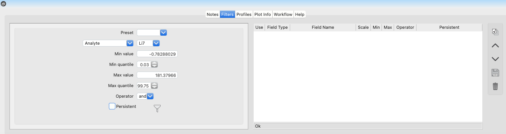

Lower Tabs
**********

The *Lower Tabs* provide additional functionality for documentation, value filtering, profile visualization, enhancing your analysis workflow, and accessing help resources. 

Notes
=====

The *Notes* tab is a powerful tool for documenting observations and analyses directly within *LaME*.  This integrated note-taking system helps you document your analysis workflow and prepare report-style documentation.  The tab supports reStructuredText (reST) formatting for creating well-structured notes that can be exported as PDF documents.  For detailed information about note-taking features and formatting, see :doc:`notes`.

.. figure:: _static/screenshots/LaME_Lower_Tab.png
    :align: center
    :alt: LaME interface: lower tab
    :width: 600

    The *Notes* tab showing the text editor and formatting tools.

Filters
=======

The *Filters* tab allows users to apply filters to their data to remove noise and enhance the signal.  For detailed information on how to apply filters, please refer to the :doc:`filtering` section.

    The *Filters* tab showing active filters and their parameters.

Profiles
========

The Profiles tab visualizes compositional variations along user-defined transects. This functionality proves particularly valuable for examining mineral zoning, reaction boundaries, and diffusion profiles. The tab provides tools for creating, editing, and analyzing profiles, with options for different display styles and error representation. For detailed information about profile analysis, see :doc:`profiles`.

.. figure:: _static/screenshots/LaME_Profile_Plot.png
    :align: center
    :alt: Profile tab interface
    :width: 600

    The *Profiles* tab displaying a compositional profile.

Plot Info
=========

The *Plot Info* tab provides detailed information about the plot that is currently displayed in the *Plot Window*.  Users can view the plot type, the data that is being displayed, and other relevant information about the plot.  

    The *Plot Info* tab displaying detailed information about the plot.

Workflow
========

The *Workflow* tab provides a visual representation of the analysis steps that have been applied to the data.  Users can view the order in which the analysis steps were applied and can easily navigate between the steps.  For detailed information on how to use the Workflow tab, please refer to the :doc:`workflow` section.

Help
====

The *Help* tab provides access to the user manual within the program. It allows users to access detailed documentation and instructions on how to use various features and functionalities of the program.

.. |icon-heading| image:: _static/icons/icon-heading-64.png
    :height: 2ex