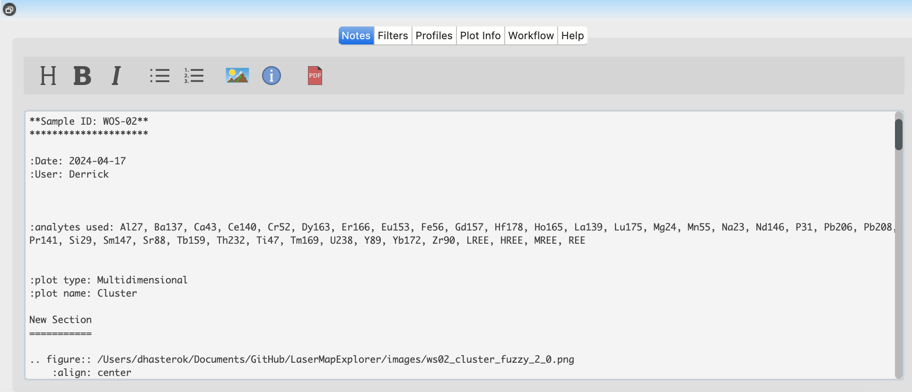

Lower Tabs
**********

The Lower Tabs provide additional functionality for note-taking and profile visualization, enhancing your analysis workflow。

    The Lower Tabs section of the *LaME* interface, providing access to Notes and Profiles features.

Notes
=====

The Notes tab is a powerful tool for documenting observations and analyses directly within *LaME*. This integrated note-taking capability allows users to store notes on a sample alongside their analysis files. It enables the rapid production of report-style documentation for samples or analyses. The Notes tab supports reStructured Text (reST) formatting, providing a flexible and powerful way to create well-structured notes and allows user to export the note as PDF documents. 

Intro to reStructured Text (reST)
---------------------------------
reST is a simple yet powerful markup language. Here are some basic formatting options:

==========================  =====================
Text                        Result
==========================  =====================
``*italics*``               *italics*
``**bold**``                **bold**
``reference_``              reference_
``[1]_``                    [1]_ footnote
``[Citation2024]_``         [Citation2024]_
==========================  =====================

.. [1] ``.. [1]`` creates a footnote

``.. _reference: http://www.this-is-an-external-hyperlink.org``

To use a phrase as a reference, enclose the words within backticks (`) and end with an underscore (_).

.. [Citation2024] ``.. [Citation2024]`` will produce a journal-like citation (no spaces).

To display a special character, use a '\\'

Titles, sections, and subsections can be created by including a line of \*, \=, and \- characters, the same length as the heading text. Use the |icon-heading| button to quickly add these symbols.

Filters
=======

The Filters tab allows users to apply filters to their data to remove noise and enhance the signal.  For detailed information on how to apply filters, please refer to the :doc:`filtering` section.

Profiles
========

The Profiles tab allows for the visualization of data trends across specific sections of a sample.  Users can create and view profile plots to analyze how various parameters change along a particular path or cross-section of their sample.  For detailed information on how to create profiles, please refer to the :doc:`left_toolbox` section.

Plot Info
=========

Workflow
========

The Workflow tab provides a visual representation of the analysis steps that have been applied to the data.  Users can view the order in which the analysis steps were applied and can easily navigate between the steps.  For detailed information on how to use the Workflow tab, please refer to the :doc:`left_toolbox` section.

Help
====

The Help tab provides access to the user manual within the program. It allows users to access detailed documentation and instructions on how to use various features and functionalities of the program.

.. |icon-heading| image:: _static/icons/icon-heading-64.png
    :height: 2ex