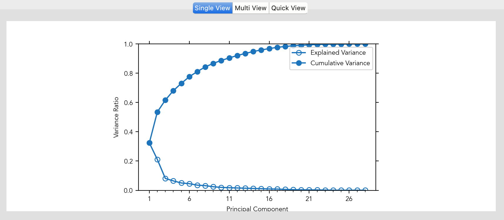
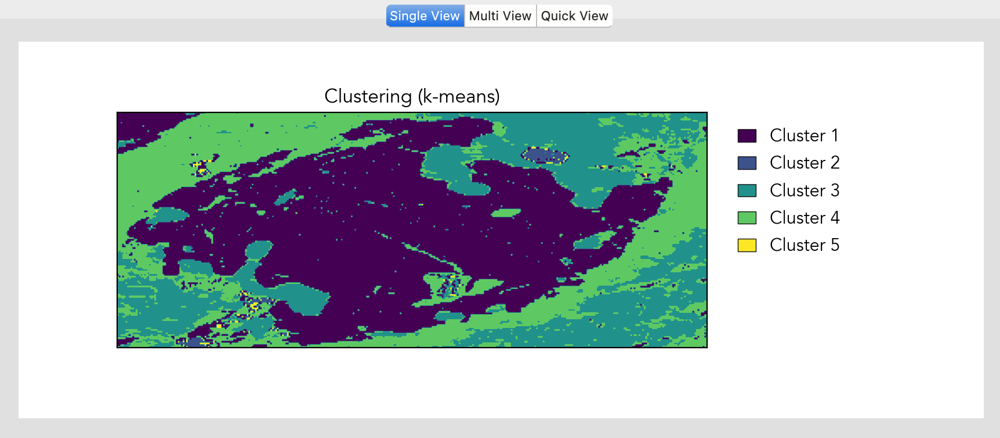
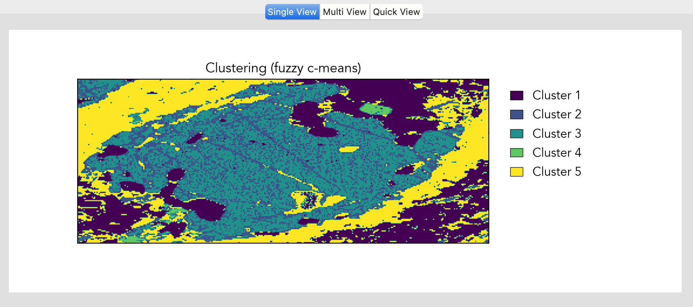

Multidimensional Methods
************************

Principal Component Analysis
===========================

Principal Component Analysis (PCA) in *LaME* reduces the dimensionality of complex datasets while preserving important variations. This tool is particularly valuable for identifying dominant compositional trends and relationships between elements.

    PCA Variance plot. 
    
Computing PCA
------------

PCA analysis is automatically computed when you select the *Dimensional Reduction* tab in the *Control Toolbox*. The software displays the explained variance plot by default, showing the proportion of variance captured by each principal component.

Visualization Options
-------------------

*LaME* offers five complementary ways to visualize PCA results:

- Variance: Shows the proportion of variance explained by each principal component
- Vector: Displays element contributions to each principal component
- PCA scatter: Plots samples in principal component space
- PCA heatmap: Shows density of points in principal component space
- PCA score: Maps principal component values back to sample space

Plot Controls
------------

For scatter plots and heatmaps, use the PC X and PC Y spinboxes to select which principal components to compare. The first principal component (PC1) explains the most variance, with subsequent components capturing progressively less variation.

Clustering
=========

Clustering in *LaME* helps identify natural groupings within your data based on compositional similarities. The software offers two clustering methods, each suited to different analytical needs.

K-Means Clustering
----------------

K-means clustering divides data into a specified number of groups by minimizing the distance between points and their cluster centers:

    K-means Clustering plot.

Fuzzy C-Means Clustering
----------------------

Fuzzy c-means allows points to belong partially to multiple clusters, providing membership scores for each cluster:

    Fuzzy C-Means Clustering plot.

Settings
--------

- Number of clusters: Set the desired number of groups
- Exponent: Control the influence of distance on cluster assignment
- Distance: Choose between Euclidean, Manhattan, Mahalanobis, or Cosine distance
- Starting seed: Random or user-defined seed for cluster initialization
- PCA: Use principal components for clustering
- Number of bias: Set the number of bias points

Visualization Options
------------------

- Cluster Map: Spatial distribution of clusters
- Cluster Scores: Degree of membership in each cluster
- Cluster Performance: Metrics to help optimize cluster numbers

.. |icon-atom| image:: _static/icons/icon-atom-64.png
    :height: 2ex