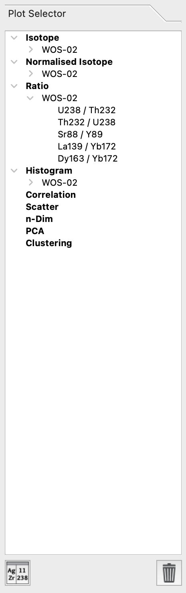
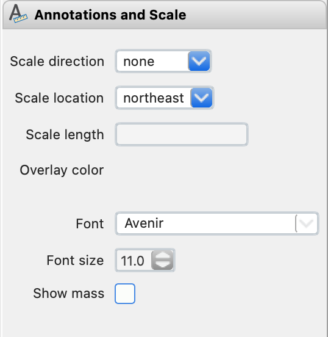
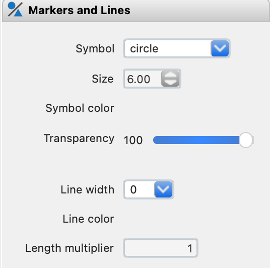
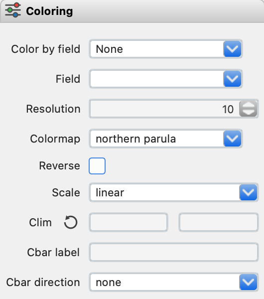
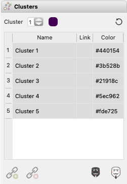
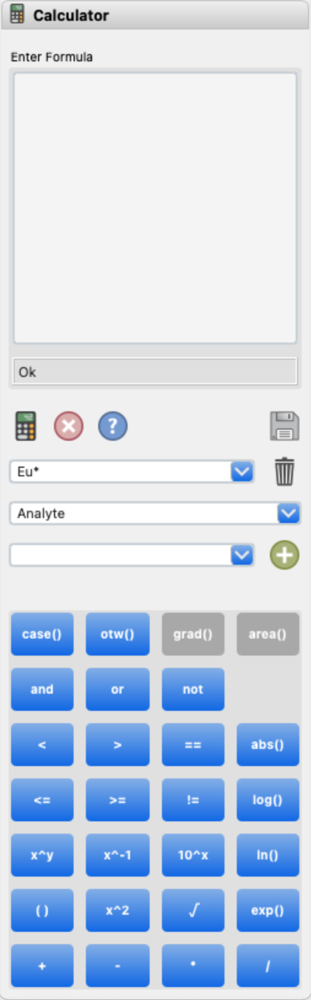
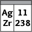

Plot and Property Toolbox (Right)
*********************************

The *Plot and Property Toolbox* consists of three major tabs: a tree containing saved plots (*Plot Selector*); a styling pane with plot options; and a calculator for creating custom fields.

Plot Selector
=============

The *Plot Selector* lists the available plots for display.  The default list includes all analytes and their normalized versions.  Ratios can be added by selecting them from *Analyte Selector*.  All other plots in the list are generated once they have been created and/or explicitly stored.

    The *Plot Selector* is similar to a file tree.  It lists types of fields, samples and the plots available beneath each.

Analytes and their normalized equivalents can be sorted alphabetically, by mass, or compatibility.  To change the sorting method, click the |icon-sort| button.  Remove plots using the |icon-trash| button.  Clicking the save button will bring up a dialog.  Input the name for the new theme and click ok after entering a name.  If the name is the same as an existing theme, the original will be overwritten.

Styling Pane
------------

The properties in the styling pane control the look and feel of plots generated from functions in the *Control (Right) Toolbox*.  In also controls the type of plot that is generated (e.g., analyte map, scatter plot or heatmap, etc.).  A complete list is given in the table below along with each of the properties that can be changed.  Not all properties are available for each type of plot.

Four controls sit above the styling pages.  The plot selector updates the types of plots available to each of the *Control Toolbox* tabs.  In case the plot does not update, click the |icon-launch| button.  Styles can be customized and saved using the save ( |icon-save| ) button.  Saved themes can be recalled in future sessions.

+----------------+---------------------------+----------------------+-----------------------------------------------+----------+----------+--------------------------------------------------------------------------+--------------------------+------------+
| tab            | Samples and Fields        | Preprocessing        | Scatter & Heatmap                             | n-Dim               | PCA                                                                      | Clustering               | Profiling |
+================+=============+=============+===========+==========+================+================+=============+==========+==========+==========+=========+====================+====================+===========+==========+===============+============+
| plot type      | analyte map | correlation | histogram | gradient | scatter        | heatmap        | ternary map | TEC      | radar    | variance | vectors | PCx vs PCy scatter | PCx vs PCy heatmap | PCA score | clusters | cluster score | profiles   |
+----------------+-------------+-------------+-----------+----------+----------------+----------------+-------------+----------+----------+----------+---------+--------------------+--------------------+-----------+----------+---------------+------------+
| axes & labels  |                                                                                                                                                                                                                                           |
+----------------+-------------+-------------+-----------+----------+----------------+----------------+-------------+----------+----------+----------+---------+--------------------+--------------------+-----------+----------+---------------+------------+
| x label        | N           | N           | Y         | N        | Y              | Y              | N           | N        | N        | N        | N       | Y                  | Y                  | N         | N        | N             | Y          |
+----------------+-------------+-------------+-----------+----------+----------------+----------------+-------------+----------+----------+----------+---------+--------------------+--------------------+-----------+----------+---------------+------------+
| y label        | N           | N           | Y         | N        | Y              | Y              | N           | Y        | N        | N        | N       | Y                  | Y                  | N         | N        | N             | N          |
+----------------+-------------+-------------+-----------+----------+----------------+----------------+-------------+----------+----------+----------+---------+--------------------+--------------------+-----------+----------+---------------+------------+
| z label        | N           | N           | N         | N        | N/Y [4]_       | N/Y [4]_       | N           | N        | N        | N        | N       | N                  | N                  | N         | N        | N             | N          |
+----------------+-------------+-------------+-----------+----------+----------------+----------------+-------------+----------+----------+----------+---------+--------------------+--------------------+-----------+----------+---------------+------------+
| x limits       | Y           | N           | Y         | Y        | Y              | Y              | Y           | N        | N        | N        | N       | Y                  | Y                  | Y         | Y        | Y             | Y          |
+----------------+-------------+-------------+-----------+----------+----------------+----------------+-------------+----------+----------+----------+---------+--------------------+--------------------+-----------+----------+---------------+------------+
| y limits       | Y           | N           | Y         | Y        | Y              | Y              | Y           | Y        | N        | N        | N       | Y                  | Y                  | Y         | Y        | Y             | N          |
+----------------+-------------+-------------+-----------+----------+----------------+----------------+-------------+----------+----------+----------+---------+--------------------+--------------------+-----------+----------+---------------+------------+
| aspect ratio   | N           | N           | Y         | N        | Y              | Y              | N           | Y        | N        | Y        | N       | Y                  | Y                  | N         | N        | N             | Y          |
+----------------+-------------+-------------+-----------+----------+----------------+----------------+-------------+----------+----------+----------+---------+--------------------+--------------------+-----------+----------+---------------+------------+
| tick direction | N           | Y           | Y         | N        | Y              | Y              | N           | Y        | N        | Y        | Y       | Y                  | Y                  | N         | N        | N             | Y          |
+----------------+-------------+-------------+-----------+----------+----------------+----------------+-------------+----------+----------+----------+---------+--------------------+--------------------+-----------+----------+---------------+------------+
| annotations    |                                                                                                                                                                                                                                           |
+----------------+-------------+-------------+-----------+----------+----------------+----------------+-------------+----------+----------+----------+---------+--------------------+--------------------+-----------+----------+---------------+------------+
| font           | Y           | Y           | Y         | Y        | Y              | Y              | Y           | Y        | Y        | Y        | Y       | Y                  | Y                  | Y         | Y        | Y             | Y          |
+----------------+-------------+-------------+-----------+----------+----------------+----------------+-------------+----------+----------+----------+---------+--------------------+--------------------+-----------+----------+---------------+------------+
| font size      | Y           | Y           | Y         | Y        | Y              | Y              | Y           | Y        | Y        | Y        | Y       | Y                  | Y                  | Y         | Y        | Y             | Y          |
+----------------+-------------+-------------+-----------+----------+----------------+----------------+-------------+----------+----------+----------+---------+--------------------+--------------------+-----------+----------+---------------+------------+
| scales         |                                                                                                                                                                                                                                           |
+----------------+-------------+-------------+-----------+----------+----------------+----------------+-------------+----------+----------+----------+---------+--------------------+--------------------+-----------+----------+---------------+------------+
| scale direct.  | Y           | N           | N         | Y        | N              | N              | Y           | N        | N        | N        | N       | N                  | N                  | Y         | Y        | Y             | Y          |
+----------------+-------------+-------------+-----------+----------+----------------+----------------+-------------+----------+----------+----------+---------+--------------------+--------------------+-----------+----------+---------------+------------+
| scale location | Y           | N           | N         | Y        | N              | N              | Y           | N        | N        | N        | N       | N                  | N                  | Y         | Y        | Y             | Y          |
+----------------+-------------+-------------+-----------+----------+----------------+----------------+-------------+----------+----------+----------+---------+--------------------+--------------------+-----------+----------+---------------+------------+
| overlay color  | Y           | N           | N         | Y        | N              | N              | Y           | N        | N        | N        | N       | N                  | N                  | Y         | Y        | Y             | Y          |
+----------------+-------------+-------------+-----------+----------+----------------+----------------+-------------+----------+----------+----------+---------+--------------------+--------------------+-----------+----------+---------------+------------+
| markers        |                                                                                                                                                                                                                                           |
+----------------+-------------+-------------+-----------+----------+----------------+----------------+-------------+----------+----------+----------+---------+--------------------+--------------------+-----------+----------+---------------+------------+
| symbol         | N/Y [1]_    | N           | N         | N/Y [1]_ | Y              | N              | N           | N        | N        | Y        | N       | Y                  | N                  | N/Y [1]_  | N/Y [1]_ | N/Y [1]_      | Y          |
+----------------+-------------+-------------+-----------+----------+----------------+----------------+-------------+----------+----------+----------+---------+--------------------+--------------------+-----------+----------+---------------+------------+
| size           | N/Y [1]_    | N           | N         | N/Y [1]_ | Y              | N              | N           | N        | N        | Y        | N       | Y                  | N                  | N/Y [1]_  | N/Y [1]_ | N/Y [1]_      | Y          |
+----------------+-------------+-------------+-----------+----------+----------------+----------------+-------------+----------+----------+----------+---------+--------------------+--------------------+-----------+----------+---------------+------------+
| transparency   | N/Y [1]_    | N           | Y         | N/Y [1]_ | Y              | N              | N           | Y        | Y        | N        | N       | Y                  | N                  | N/Y [1]_  | N/Y [1]_ | N/Y [1]_      | N          |
+----------------+-------------+-------------+-----------+----------+----------------+----------------+-------------+----------+----------+----------+---------+--------------------+--------------------+-----------+----------+---------------+------------+
| lines          |                                                                                                                                                                                                                                           |
+----------------+-------------+-------------+-----------+----------+----------------+----------------+-------------+----------+----------+----------+---------+--------------------+--------------------+-----------+----------+---------------+------------+
| line width     | N/Y [2]_    | N           | Y         | N/Y [2]_ | Y [6]_/ N [4]_ | Y [6]_/ N [4]_ | N           | Y        | Y        | Y        | N       | Y [7]_             | Y                  | N/Y [2]_  | N/Y [2]_ | N/Y [2]_      | Y [9]_     |
+----------------+-------------+-------------+-----------+----------+----------------+----------------+-------------+----------+----------+----------+---------+--------------------+--------------------+-----------+----------+---------------+------------+
| colors         |                                                                                                                                                                                                                                           |
+----------------+-------------+-------------+-----------+----------+----------------+----------------+-------------+----------+----------+----------+---------+--------------------+--------------------+-----------+----------+---------------+------------+
| color          | N           | N           | Y/N [3]_  | N        | Y/N [5]_       | N              | N           | Y/N [3]_ | Y/N [3]_ | Y        | N       | Y/N [5]_           | N                  | N         | N        | N             | Y          |
+----------------+-------------+-------------+-----------+----------+----------------+----------------+-------------+----------+----------+----------+---------+--------------------+--------------------+-----------+----------+---------------+------------+
| color by field | Y           | N           | Y         | Y        | Y              | N              | N           | Y        | Y        | N        | N       | N/Y [5]_           | N                  | N         | N        | N             | N          |
+----------------+-------------+-------------+-----------+----------+----------------+----------------+-------------+----------+----------+----------+---------+--------------------+--------------------+-----------+----------+---------------+------------+
| field          | Y           | N           | Y         | Y        | Y              | N              | N           | N        | N        | N        | N       | Y                  | N                  | Y [8]_    | N        | Y [8]_        | N          |
+----------------+-------------+-------------+-----------+----------+----------------+----------------+-------------+----------+----------+----------+---------+--------------------+--------------------+-----------+----------+---------------+------------+
| colormap       | Y           | Y           | N/Y [3]_  | Y        | N/Y [5]_       | Y              | custom      | Y [3]_   | Y [3]_   | N        | Y       | N/Y [5]_           | Y                  | Y         | Y        | Y             | Y          |
+----------------+-------------+-------------+-----------+----------+----------------+----------------+-------------+----------+----------+----------+---------+--------------------+--------------------+-----------+----------+---------------+------------+
| color limits   | Y           | Y [-1, 1]   | N/Y [3]_  | Y        | N/Y [5]_       | Y              | N           | N        | N        | N        | Y       | N/Y [5]_           | Y                  | Y         | N        | Y             | N          |
+----------------+-------------+-------------+-----------+----------+----------------+----------------+-------------+----------+----------+----------+---------+--------------------+--------------------+-----------+----------+---------------+------------+
| c.bar direct.  | Y           | Y           | N         | Y        | N/Y [5]_       | Y              | N           | N        | N        | N        | Y       | N/Y [5]_           | Y                  | Y         | N        | Y             | N          |
+----------------+-------------+-------------+-----------+----------+----------------+----------------+-------------+----------+----------+----------+---------+--------------------+--------------------+-----------+----------+---------------+------------+
| c.bar label    | Y           | N           | N         | Y        | N/Y [5]_       | Y              | N           | N        | N        | N        | N       | N/Y [5]_           | Y                  | Y         | N        | Y             | N          |
+----------------+-------------+-------------+-----------+----------+----------------+----------------+-------------+----------+----------+----------+---------+--------------------+--------------------+-----------+----------+---------------+------------+
| resolution     | N           | N           | N         | N        | N              | Y              | N           | N        | N        | N        | N       | N                  | Y                  | N         | N        | N             | N          |
+----------------+-------------+-------------+-----------+----------+----------------+----------------+-------------+----------+----------+----------+---------+--------------------+--------------------+-----------+----------+---------------+------------+

.. [1] for displaying spot data
.. [2] for displaying polygons
.. [3] when clusters are selected for color by field
.. [4] ternary plot
.. [5] color by field is not none
.. [6] for linear fits
.. [7] for displaying vector components
.. [8] for scores only
.. [9] error bars

Axes and Labels
+++++++++++++++

The axes and labels are filled initially with default values, but can be edited to update the plot.

.. figure:: _static/screenshots/LaME_Styles_Axes_Labels.png
    :align: center
    :alt: LaME interface: right toolbox, styling-axes-and-labels tab
    :width: 232

    The *Styling \> Axes and Labels* contains general settings applied to all plots.

Annotations
+++++++++++

    The *Styling \> Annotations* contains font type and font size settings.

Scales
++++++

.. figure:: _static/screenshots/LaME_Styling_Scales.png
    :align: center
    :alt: LaME interface: right toolbox, Styling-scales tab
    :width: 232

    The *Styling \> Scatter and Heatmap* contains settings for scatter plots and heatmaps including correlations.

Markers
+++++++

    The *Styling \> Markers* contains settings for markers used in scatter, ternary, and PCA plots. 
    
For other plot types text is greyed out, indicating these settings can not be modified. Symbol options, symbol size, and transparency are modified in this tab. 

Lines
+++++

.. figure:: _static/screenshots/LaME_Styling_Lines.png
    :align: center
    :alt: LaME interface: right toolbox, Styling-lines tab
    :width: 232

    The *Styling \> Lines* contains settings for line width used in TEC, radar, variance, and PCx plots. 

Line widths range from 0.25 to 6 pt. 

Colors
++++++

    The *Styling |> Colors* contains settings for changing color options.

Use the Color tab to choose and modify the colors applied to plots. The *Colors \> Color* tick box brings up a color picker, the use of which is described below. If the box is left unticked, preset color maps are available under the *Colors \> Colormap* dropdown menu. The *Colors \> Color Limits* setting allows selection of a subset of the color range from a chosen colormap. 

The *Colors \> Cbar* direction allows user to choose horizontal or vertical placement of the Color Bar legend. The *Colors \> Cbar* label allows user to specify legend label.

Color picker
------------
.. figure:: _static/screenshots/LaME_Styling_Colors_Colorpicker.png
    :align: center
    :alt: LaME interface: right toolbox, styling-colors tab
    :width: 232

    The *Styling \> Colors \> Color* opens a color picker window

The *Colors \> Color* color picker allows users to pick colors from a color wheel. The color is chosen by positioning the pointer over the desired location on the color wheel. Color intensity can be modified by the greyscale slider located under the color wheel. Colors are added to the available color choices only after the *OK* button is pushed.

Clusters
++++++++

    The *Styling \> Clustering* contains options for working with clustered data

Clustering is available if the *Styling \> Colors \> Color by field* is set to *Clusters*. Clustered data can be assigned a name and color. Clusters can be linked ( |icon-link| ) or unlinked ( |icon-unlink| ). A selected cluster or clusters can be used to mask ( |icon-mask-dark| ) or reverse mask ( |icon-mask-light| ) data in a plot or on a map.

Calculator
----------

    The *Calculator* can be used to compute custom fields.  Expressions can be typed directly into the edit box, by clicking the buttons.

Use the calculator ( |icon-calculator| ) to create :doc:`custom_fields`.  These custom fields can be used to as dimensions on plots or to set marker color values.  Once created, custom fields will be added to associated drop downs.

.. |icon-launch| image:: _static/icons/icon-launch-64.png
    :height: 2ex

.. |icon-calculator| image:: _static/icons/icon-calculator-64.png
    :height: 2ex

