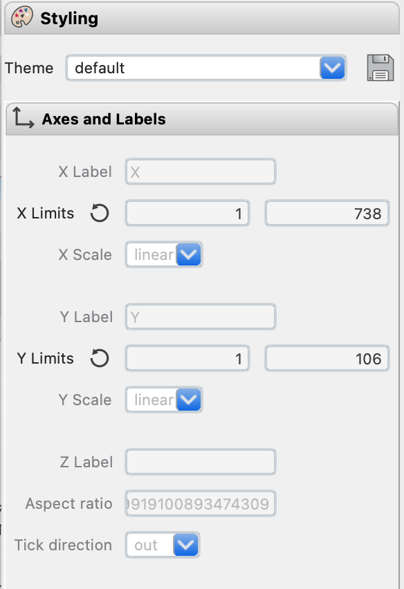
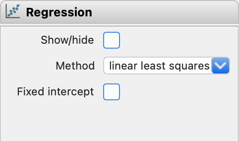

Plot and Property Toolbox (Right)
*********************************

The *Plot and Property Toolbox* consists of three major components: the Plot Selector, the Styling Pane, and the Calculator. These tools work together to provide comprehensive control over plot creation, customization, and data manipulation.

Plot Selector
=============

The plot type dropdown list sits above the *Plot Selector*. It updates the types of plots available to each of the *Control Toolbox* tabs. In case the plot does not update automatically, the |icon-launch| button can be clicked. 

The *Plot Selector* lists the available plots for display.  By default, it includes all analytes and their normalized versions.  Ratios can be added by selecting them from the *Analyte Selector* in the *Main Toolbar*.  Other plots will also appear in the list once they've been created or explicitly saved.

Analytes and their normalized equivalents can be sorted alphabetically, by mass, or compatibility using the |icon-sort| button.  To remove plots, use the |icon-trash| button.  

.. figure:: _static/screenshots/LaME_Plot_Selector.png
    :align: center
    :alt: LaME interface: right toolbox, plot selector tab
    :width: 232

    The *Plot Selector* is similar to a file tree.  It lists types of fields, samples and the plots available beneath each.

Styling Pane
============

The Styling Pane controls the appearance of plots generated from functions in the *Control Toolbox*.  It also controls the type of plot generated (e.g., analyte map, scatter plot, heatmap, etc.).  A complete list is given in the table below along with each of the properties that can be changed.  Not all properties are available for each type of plot.  Styles can be customized and saved using the save ( |icon-save| ) button.  Saved themes can be recalled in future sessions.

.. table:: 
    +----------------+---------------------------+----------------------+-----------------------------------------------+----------+----------+--------------------------------------------------------------------------+--------------------------+------------+
    | tab            | Samples and Fields        | Preprocessing        | Scatter & Heatmap                             | n-Dim               | PCA                                                                      | Clustering               | Profiling |
    +================+=============+=============+===========+==========+================+================+=============+==========+==========+==========+=========+====================+====================+===========+==========+===============+============+
    | plot type      | analyte map | correlation | histogram | gradient | scatter        | heatmap        | ternary map | TEC      | radar    | variance | vectors | PCx vs PCy scatter | PCx vs PCy heatmap | PCA score | clusters | cluster score | profiles   |
    +----------------+-------------+-------------+-----------+----------+----------------+----------------+-------------+----------+----------+----------+---------+--------------------+--------------------+-----------+----------+---------------+------------+
    | axes & labels  |                                                                                                                                                                                                                                           |
    +----------------+-------------+-------------+-----------+----------+----------------+----------------+-------------+----------+----------+----------+---------+--------------------+--------------------+-----------+----------+---------------+------------+
    | x label        | N           | N           | Y         | N        | Y              | Y              | N           | N        | N        | N        | N       | Y                  | Y                  | N         | N        | N             | Y          |
    +----------------+-------------+-------------+-----------+----------+----------------+----------------+-------------+----------+----------+----------+---------+--------------------+--------------------+-----------+----------+---------------+------------+
    | y label        | N           | N           | Y         | N        | Y              | Y              | N           | Y        | N        | N        | N       | Y                  | Y                  | N         | N        | N             | N          |
    +----------------+-------------+-------------+-----------+----------+----------------+----------------+-------------+----------+----------+----------+---------+--------------------+--------------------+-----------+----------+---------------+------------+
    | z label        | N           | N           | N         | N        | N/Y [4]_       | N/Y [4]_       | N           | N        | N        | N        | N       | N                  | N                  | N         | N        | N             | N          |
    +----------------+-------------+-------------+-----------+----------+----------------+----------------+-------------+----------+----------+----------+---------+--------------------+--------------------+-----------+----------+---------------+------------+
    | x limits       | Y           | N           | Y         | Y        | Y              | Y              | Y           | N        | N        | N        | N       | Y                  | Y                  | Y         | Y        | Y             | Y          |
    +----------------+-------------+-------------+-----------+----------+----------------+----------------+-------------+----------+----------+----------+---------+--------------------+--------------------+-----------+----------+---------------+------------+
    | y limits       | Y           | N           | Y         | Y        | Y              | Y              | Y           | Y        | N        | N        | N       | Y                  | Y                  | Y         | Y        | Y             | N          |
    +----------------+-------------+-------------+-----------+----------+----------------+----------------+-------------+----------+----------+----------+---------+--------------------+--------------------+-----------+----------+---------------+------------+
    | aspect ratio   | N           | N           | Y         | N        | Y              | Y              | N           | Y        | N        | Y        | N       | Y                  | Y                  | N         | N        | N             | Y          |
    +----------------+-------------+-------------+-----------+----------+----------------+----------------+-------------+----------+----------+----------+---------+--------------------+--------------------+-----------+----------+---------------+------------+
    | tick direction | N           | Y           | Y         | N        | Y              | Y              | N           | Y        | N        | Y        | Y       | Y                  | Y                  | N         | N        | N             | Y          |
    +----------------+-------------+-------------+-----------+----------+----------------+----------------+-------------+----------+----------+----------+---------+--------------------+--------------------+-----------+----------+---------------+------------+
    | annotations    |                                                                                                                                                                                                                                           |
    +----------------+-------------+-------------+-----------+----------+----------------+----------------+-------------+----------+----------+----------+---------+--------------------+--------------------+-----------+----------+---------------+------------+
    | font           | Y           | Y           | Y         | Y        | Y              | Y              | Y           | Y        | Y        | Y        | Y       | Y                  | Y                  | Y         | Y        | Y             | Y          |
    +----------------+-------------+-------------+-----------+----------+----------------+----------------+-------------+----------+----------+----------+---------+--------------------+--------------------+-----------+----------+---------------+------------+
    | font size      | Y           | Y           | Y         | Y        | Y              | Y              | Y           | Y        | Y        | Y        | Y       | Y                  | Y                  | Y         | Y        | Y             | Y          |
    +----------------+-------------+-------------+-----------+----------+----------------+----------------+-------------+----------+----------+----------+---------+--------------------+--------------------+-----------+----------+---------------+------------+
    | scales         |                                                                                                                                                                                                                                           |
    +----------------+-------------+-------------+-----------+----------+----------------+----------------+-------------+----------+----------+----------+---------+--------------------+--------------------+-----------+----------+---------------+------------+
    | scale direct.  | Y           | N           | N         | Y        | N              | N              | Y           | N        | N        | N        | N       | N                  | N                  | Y         | Y        | Y             | Y          |
    +----------------+-------------+-------------+-----------+----------+----------------+----------------+-------------+----------+----------+----------+---------+--------------------+--------------------+-----------+----------+---------------+------------+
    | scale location | Y           | N           | N         | Y        | N              | N              | Y           | N        | N        | N        | N       | N                  | N                  | Y         | Y        | Y             | Y          |
    +----------------+-------------+-------------+-----------+----------+----------------+----------------+-------------+----------+----------+----------+---------+--------------------+--------------------+-----------+----------+---------------+------------+
    | overlay color  | Y           | N           | N         | Y        | N              | N              | Y           | N        | N        | N        | N       | N                  | N                  | Y         | Y        | Y             | Y          |
    +----------------+-------------+-------------+-----------+----------+----------------+----------------+-------------+----------+----------+----------+---------+--------------------+--------------------+-----------+----------+---------------+------------+
    | markers        |                                                                                                                                                                                                                                           |
    +----------------+-------------+-------------+-----------+----------+----------------+----------------+-------------+----------+----------+----------+---------+--------------------+--------------------+-----------+----------+---------------+------------+
    | symbol         | N/Y [1]_    | N           | N         | N/Y [1]_ | Y              | N              | N           | N        | N        | Y        | N       | Y                  | N                  | N/Y [1]_  | N/Y [1]_ | N/Y [1]_      | Y          |
    +----------------+-------------+-------------+-----------+----------+----------------+----------------+-------------+----------+----------+----------+---------+--------------------+--------------------+-----------+----------+---------------+------------+
    | size           | N/Y [1]_    | N           | N         | N/Y [1]_ | Y              | N              | N           | N        | N        | Y        | N       | Y                  | N                  | N/Y [1]_  | N/Y [1]_ | N/Y [1]_      | Y          |
    +----------------+-------------+-------------+-----------+----------+----------------+----------------+-------------+----------+----------+----------+---------+--------------------+--------------------+-----------+----------+---------------+------------+
    | transparency   | N/Y [1]_    | N           | Y         | N/Y [1]_ | Y              | N              | N           | Y        | Y        | N        | N       | Y                  | N                  | N/Y [1]_  | N/Y [1]_ | N/Y [1]_      | N          |
    +----------------+-------------+-------------+-----------+----------+----------------+----------------+-------------+----------+----------+----------+---------+--------------------+--------------------+-----------+----------+---------------+------------+
    | lines          |                                                                                                                                                                                                                                           |
    +----------------+-------------+-------------+-----------+----------+----------------+----------------+-------------+----------+----------+----------+---------+--------------------+--------------------+-----------+----------+---------------+------------+
    | line width     | N/Y [2]_    | N           | Y         | N/Y [2]_ | Y [6]_/ N [4]_ | Y [6]_/ N [4]_ | N           | Y        | Y        | Y        | N       | Y [7]_             | Y                  | N/Y [2]_  | N/Y [2]_ | N/Y [2]_      | Y [9]_     |
    +----------------+-------------+-------------+-----------+----------+----------------+----------------+-------------+----------+----------+----------+---------+--------------------+--------------------+-----------+----------+---------------+------------+
    | colors         |                                                                                                                                                                                                                                           |
    +----------------+-------------+-------------+-----------+----------+----------------+----------------+-------------+----------+----------+----------+---------+--------------------+--------------------+-----------+----------+---------------+------------+
    | color          | N           | N           | Y/N [3]_  | N        | Y/N [5]_       | N              | N           | Y/N [3]_ | Y/N [3]_ | Y        | N       | Y/N [5]_           | N                  | N         | N        | N             | Y          |
    +----------------+-------------+-------------+-----------+----------+----------------+----------------+-------------+----------+----------+----------+---------+--------------------+--------------------+-----------+----------+---------------+------------+
    | color by field | Y           | N           | Y         | Y        | Y              | N              | N           | Y        | Y        | N        | N       | N/Y [5]_           | N                  | N         | N        | N             | N          |
    +----------------+-------------+-------------+-----------+----------+----------------+----------------+-------------+----------+----------+----------+---------+--------------------+--------------------+-----------+----------+---------------+------------+
    | field          | Y           | N           | Y         | Y        | Y              | N              | N           | N        | N        | N        | N       | Y                  | N                  | Y [8]_    | N        | Y [8]_        | N          |
    +----------------+-------------+-------------+-----------+----------+----------------+----------------+-------------+----------+----------+----------+---------+--------------------+--------------------+-----------+----------+---------------+------------+
    | colormap       | Y           | Y           | N/Y [3]_  | Y        | N/Y [5]_       | Y              | custom      | Y [3]_   | Y [3]_   | N        | Y       | N/Y [5]_           | Y                  | Y         | Y        | Y             | Y          |
    +----------------+-------------+-------------+-----------+----------+----------------+----------------+-------------+----------+----------+----------+---------+--------------------+--------------------+-----------+----------+---------------+------------+
    | color limits   | Y           | Y [-1, 1]   | N/Y [3]_  | Y        | N/Y [5]_       | Y              | N           | N        | N        | N        | Y       | N/Y [5]_           | Y                  | Y         | N        | Y             | N          |
    +----------------+-------------+-------------+-----------+----------+----------------+----------------+-------------+----------+----------+----------+---------+--------------------+--------------------+-----------+----------+---------------+------------+
    | c.bar direct.  | Y           | Y           | N         | Y        | N/Y [5]_       | Y              | N           | N        | N        | N        | Y       | N/Y [5]_           | Y                  | Y         | N        | Y             | N          |
    +----------------+-------------+-------------+-----------+----------+----------------+----------------+-------------+----------+----------+----------+---------+--------------------+--------------------+-----------+----------+---------------+------------+
    | c.bar label    | Y           | N           | N         | Y        | N/Y [5]_       | Y              | N           | N        | N        | N        | N       | N/Y [5]_           | Y                  | Y         | N        | Y             | N          |
    +----------------+-------------+-------------+-----------+----------+----------------+----------------+-------------+----------+----------+----------+---------+--------------------+--------------------+-----------+----------+---------------+------------+
    | resolution     | N           | N           | N         | N        | N              | Y              | N           | N        | N        | N        | N       | N                  | Y                  | N         | N        | N             | N          |
    +----------------+-------------+-------------+-----------+----------+----------------+----------------+-------------+----------+----------+----------+---------+--------------------+--------------------+-----------+----------+---------------+------------+

    .. [1] for displaying spot data
    .. [2] for displaying polygons
    .. [3] when clusters are selected for color by field
    .. [4] ternary plot
    .. [5] color by field is not none
    .. [6] for linear fits
    .. [7] for displaying vector components
    .. [8] for scores only
    .. [9] error bars

Axes and Labels
---------------

The axes and labels are initially filled with default values but can be edited to update the plot.

    The Styling \> Axes and Labels contains general settings applied to all plots.

Annotations and Scales
----------------------

The Annotations and Scales tab provides settings to add a scale bar to the plot and adjust the legend bar on the side of the plot.

.. figure:: _static/screenshots/LaME_Styling_Annotations.png
    :align: center
    :alt: LaME interface: right toolbox, styling-annotations tab
    :width: 232

    The Styling \> Annotations contains font type and font size settings.

Markers and Lines
-----------------

The Markers tab contains settings for markers and lines used in scatter, ternary, and PCA plots. For other plot types, these settings are grayed out. Symbol options, symbol size, and transparency can be modified in this tab.

.. figure:: _static/screenshots/LaME_Styling_Markers.png
    :align: center
    :alt: LaME interface: right toolbox, Styling-markers tab
    :width: 232

    The Styling > Markers and Lines tab contains settings for markers and lines used in various plots.

Coloring
--------

The Coloring tab provides a range of options for customizing the color representation of data in plots and maps.  

.. figure:: _static/screenshots/LaME_Styling_Colors.png
    :align: center
    :alt: LaME interface: right toolbox, Styling-colors tab
    :width: 232

    The Styling |> Colors contains settings for changing color options.

Clusters
--------

Clustered data can be assigned a name and color. Clusters can be linked (|icon-link|) or unlinked (|icon-unlink|). A selected cluster or clusters can be used to mask (|icon-mask-dark|) or reverse mask (|icon-mask-light|) data in a plot or on a map.

.. figure:: _static/screenshots/LaME_Styling_Clusters.png
    :align: center
    :alt: LaME interface: right toolbox, styling-clustering tab
    :width: 232

    The Styling \> Clustering contains options for working with clustered data

Regression
==========

Regression is currently under development and not available.

    Regression tab (functionality not currently available).

Calculator
==========

The calculator (|icon-calculator|) can be used to compute custom fields.  These custom fields can be used as dimensions on plots or to set marker color values.  Once created, custom fields will be added to associated drop-down menus.  For detailed information on how to use the calculator and create custom fields, please refer to the :doc:`custom_fields` section.

.. figure:: _static/screenshots/LaME_Calculator.png
    :align: center
    :alt: LaME interface: right toolbox, calculator tab
    :width: 232

    The Calculator can be used to compute custom fields.  Expressions can be typed directly into the edit box, by clicking the buttons.

.. |icon-sort| image:: _static/icons/icon-sort-64.png
    :height: 2ex

.. |icon-launch| image:: _static/icons/icon-launch-64.png
    :height: 2ex

.. |icon-save| image:: _static/icons/icon-save-file-64.png
    :height: 2ex

.. |icon-trash| image:: _static/icons/icon-delete-64.png
    :height: 2ex

.. |icon-calculator| image:: _static/icons/icon-calculator-64.png
    :height: 2ex

.. |icon-link| image:: _static/icons/icon-link-64.png
    :height: 2ex

.. |icon-unlink| image:: _static/icons/icon-unlink-64.png
    :height: 2ex

.. |icon-mask-light| image:: _static/icons/icon-mask-light-64.png
    :height: 2ex

.. |icon-mask-dark| image:: _static/icons/icon-mask-dark-64.png
    :height: 2ex