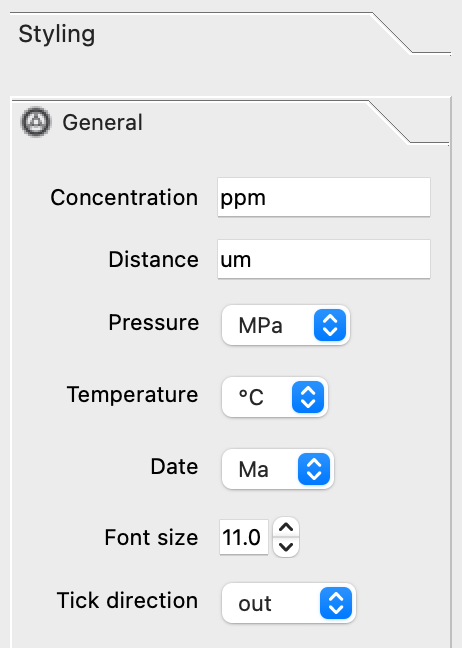

Right Toolbox
=============

Plot Selector
-------------

.. figure:: _static/screenshots/LaME_Plot_Selector.png
    :align: center
    :alt: LaME interface: right toolbox, plot selector tab
    :width: 232

    The *Plot Selector* is similar to a file tree.  It lists types of fields, samples and the plots available beneath each.

The *Plot Selector* lists the available plots for display.  The default list includes all isotopes and their normalized versions.  Ratios can be added by selecting them from *Isotope Selector*.  All other plots in the list are generated once they have been created and/or explicitly stored.

Isotopes and their normalized equivalents can be sorted alphabetically, by mass, or compatibility.  To change the sorting method, click the |icon-sort| button.

Styling Pane
------------

The properties in the styling pane control the look and feel of plots generated from functions in the left toolbox.  In some cases they also control the type of plot that is generated (e.g., scatter plot or heatmap).

General
+++++++

    The *Styling \> General* contains general settings applied to all plots.

Maps
++++

    The *Styling \> Maps* contains settings exclusive to maps.

Scatter and Heatmap
+++++++++++++++++++

.. figure:: _static/screenshots/LaME_Styling_Scatter_and_Heatmap.png
    :align: center
    :alt: LaME interface: right toolbox, styling-scatter-and-heatmaps tab
    :width: 232

    The *Styling \> Scatter and Heatmap* contains settings for scatter plots and heatmaps including correlations.

+----------------+---------------------------+-----------------------+-----------------------------+--------------+------------------------------------------------+-----------+----------+
| tab            | Samples                   | Preprocess            | Scatter & Heatmap           | n-Dim        | PCA                                            | Clusters  | Profiles |
+----------------+-------------+-------------+------------+----------+---------+---------+---------+--------------+----------+---------+---------+---------+-------+-----------+----------+
| plot type      | map         | correlation | histogram  | gradient | biplot & ternary  | ternary | TEC/radar    | variance | vectors | x vs. y | x vs. y | score | clusters  | profiles |
+================+=============+=============+============+==========+=========+=========+=========+==============+==========+=========+=========+=========+=======+===========+==========+
| style dropdown | map         | heatmap     | scatter    | map      | scatter | heatmap | map     | scatter      | scatter  | heatmap | scatter | heatmap | map   | map       | scatter  |
+----------------+-------------+-------------+------------+----------+---------+---------+---------+--------------+----------+---------+---------+---------+-------+-----------+----------+
| resolution     | N           | N           | N          | N        | N       | Y       | N       | N            | N        | N       | N       | Y       | N     | N         | N        |
+----------------+-------------+-------------+------------+----------+---------+---------+---------+--------------+----------+---------+---------+---------+-------+-----------+----------+
| symbol         | N           | N           | N          | N        | Y       | N       | N       | Y            | N        | N       | Y       | N       | N     | N         | Y        |
+----------------+-------------+-------------+------------+----------+---------+---------+---------+--------------+----------+---------+---------+---------+-------+-----------+----------+
| size           | N           | N           | N          | N        | Y       | N       | N       | Y            | Y        | N       | Y       | N       | N     | N         | Y        |
+----------------+-------------+-------------+------------+----------+---------+---------+---------+--------------+----------+---------+---------+---------+-------+-----------+----------+
| line width     | Y (polygon) | N           | N          | N        | Y (fit) | N       | N       | N            | Y        | N       | Y       | Y       | N     | N         | Y        |
+----------------+-------------+-------------+------------+----------+---------+---------+---------+--------------+----------+---------+---------+---------+-------+-----------+----------+
| color          | Y (spots)   | N           | Y          | N        | Y       | N       | N       | Y (1)        | Y        | N       | Y       | N       | N     | N         | Y        |
+----------------+-------------+-------------+------------+----------+---------+---------+---------+--------------+----------+---------+---------+---------+-------+-----------+----------+
| color by field | Y           | N           | N          | Y        | Y       | N       | N       | N            | N        | N       | Y       | N       | N     | N         | Y?       |
+----------------+-------------+-------------+------------+----------+---------+---------+---------+--------------+----------+---------+---------+---------+-------+-----------+----------+
| field          | Y           | N           | N          | Y        | Y       | N       | N       | N            | N        | N       | Y       | N       | N     | Y (score) | Y?       |
+----------------+-------------+-------------+------------+----------+---------+---------+---------+--------------+----------+---------+---------+---------+-------+-----------+----------+
| colormap       | Y           | Y           | N          | Y        | Y       | Y       | custom  | Y (clusters) | N        | Y       | Y       | Y       | Y     | N         | Y?       |
+----------------+-------------+-------------+------------+----------+---------+---------+---------+--------------+----------+---------+---------+---------+-------+-----------+----------+
| color limits   | Y           | [-1, 1]     | N          | Y        | Y       | Y       | Y       | N            | N        | Y       | Y       | Y       | Y     | N         | Y?       |
+----------------+-------------+-------------+------------+----------+---------+---------+---------+--------------+----------+---------+---------+---------+-------+-----------+----------+
| transparency   | N           | N           | Y          | N        | Y       | N       | N       | Y            | N        | N       | Y       | N       | N     | N         | Y        |
+----------------+-------------+-------------+------------+----------+---------+---------+---------+--------------+----------+---------+---------+---------+-------+-----------+----------+
| aspect ratio   | N           | 1           | Y          | N        | Y       | Y       | N       | Y            | Y        | Y       | Y       | Y       | N     | N         | Y/N      |
+----------------+-------------+-------------+------------+----------+---------+---------+---------+--------------+----------+---------+---------+---------+-------+-----------+----------+

Clusters
++++++++

.. figure:: _static/screenshots/LaME_Styling_Clusters.png
    :align: center
    :alt: LaME interface: right toolbox, styling-clustering tab
    :width: 232

    The *Styling \> Clustering* contains settings for scatter plots and heatmaps including correlations.

Calculator
----------

.. figure:: _static/screenshots/LaME_Calculator.png
    :align: center
    :alt: LaME interface: right toolbox, calculator tab
    :width: 232

    The *Calculator* can be used to compute custom fields.  Expressions can be typed directly into the edit box, by clicking the buttons.

Use the calculator ( |icon-calculator| ) to create custom fields.  These custom fields can be used to as dimensions on plots or to set marker color values.  Once created, custom fields will be added to associated drop downs.

.. |icon-calculator| image:: _static/icons/icon-calculator-64.png
    :height: 2ex