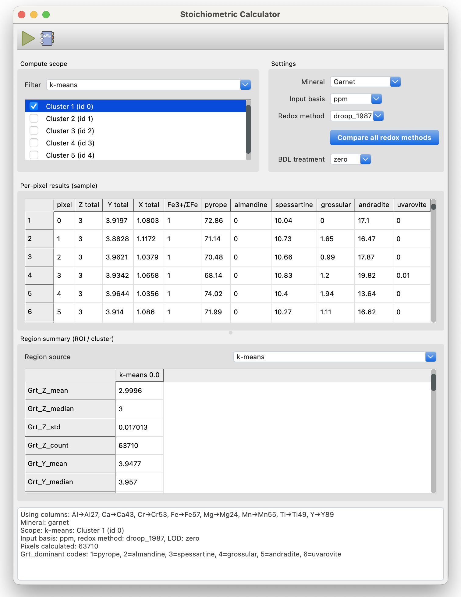

Stoichiometry
**************

The *Stoichiometric Calculator* converts a per-pixel elemental (or oxide) analysis into a full mineral formula: cations per formula unit (apfu), site occupancies, Fe\ :sup:`2+`/Fe\ :sup:`3+` split, end-member proportions, and QC diagnostics -- for every mineral *LaME* ships a config for (see the :ref:`table below <stoichiometry-mineral-table>`). Results are written back to the sample as new columns and can be mapped, plotted, or filtered exactly like any other field.

For the underlying math: normalization basis, redox estimation, site allocation, end-member methods---see :doc:`stoichiometry_technical`. For the full, current content of every mineral's YAML config, see :doc:`mineral_configs`.

    The Stoichiometry dock: compute scope, settings, per-pixel results, and region summary.

Opening the Dock
=================

Open the dock from *Analyze* \> *Stoichiometry* in the main menu, or the *Stoichiometry* button (|icon-silicate|) in the *Main Toolbar*. Like other docks, it can be toggled open/closed from the same button and floated or docked to the main window.

Compute Scope
==============

By default, the calculator runs on every pixel in the current sample. Use the *Filter* dropdown in the *Compute scope* group to restrict a run to a single ROI or cluster instead -- selecting *ROI* or a clustering method populates the list below it with the available regions, and the calculation only touches pixels inside whichever regions are checked. Running the calculator on a scoped subset does not overwrite results already computed for other regions or the full sample; each scoped run only updates the pixels it covers.

Calculator Settings
=====================

- **Mineral**: choose which mineral config (from ``resources/minerals/``) to calculate. Switching minerals reloads its config, its redox methods, and its default basis.
- **Input basis**: whether the current sample's columns should be read as element ppm (``ppm``) or oxide wt.% (``wt_percent``). *LaME* resolves each element/oxide the config needs to a matching analyte or oxide column automatically.
- **Redox method**: which Fe\ :sup:`2+`/Fe\ :sup:`3+` estimation method to use, from whichever methods the selected mineral's config enables (see :doc:`stoichiometry_technical` for what each one assumes). Only shown when the mineral has a redox-sensitive element.
- **Compare all redox methods**: when enabled, every enabled redox method is computed and reported side by side, rather than only the one selected above -- useful for seeing how sensitive the result is to the redox assumption.
- **BDL treatment**: how values flagged below detection limit are handled -- treat as zero, as half the detection limit, or exclude that element from the analysis entirely.

Running
========

Click **Run** in the toolbar to calculate over the current scope. Results appear in the *Per-pixel results (sample)* table. To summarize results by region instead, choose a *Region source* (``ROI`` or a clustering method) in the *Region summary* group -- this populates a table of mean/median/std/count per region for every computed quantity. Click **Copy to Notes** to send the results summary text to the *Notes* tab for inclusion in a report.

Output Columns
================

Every column *LaME* writes back to the sample is prefixed with the mineral's standard petrologic abbreviation (`Whitney & Evans, 2010 <https://doi.org/10.2138/am.2010.3371>`_ -- e.g. ``Grt`` for garnet), so results from different minerals never collide even when site or end-member names are reused (e.g. both garnet and spinel have a site people call "X"):

- ``{abbrev}_{site}``: total apfu allocated to each crystallographic site (e.g. ``Grt_X``, ``Grt_Y``), in units of apfu.
- ``{abbrev}_{end_member}``: mol% of each end-member (e.g. ``Grt_pyrope``), summing to 100 across a pixel's end-members.
- ``{abbrev}_dominant``: a 1-indexed code giving whichever end-member has the largest fraction at that pixel -- rendered as a discrete, swatch-legend map (like a Cluster map) rather than a continuous colorbar, since the code itself has no meaningful magnitude ordering.

Only pixels inside the compute scope are written; pixels outside it keep whatever value they already had from an earlier run, so results for different minerals or different ROIs/clusters can coexist on the same sample.

.. toctree::
   :maxdepth: 1
   :caption: More on stoichiometry

   stoichiometry_technical
   mineral_configs

.. _stoichiometry-mineral-table:

Appendix: Supported Minerals
============================

The table below lists every mineral config currently available. Click a mineral's name to view its full YAML config on the :doc:`mineral_configs` page.

.. list-table::
   :header-rows: 1
   :widths: 16 28 10 46

   * - Mineral
     - Formula
     - Basis
     - End-members
   * - :ref:`Allanite <mineral-config-allanite>`
     - CaCe(Fe2+,Fe3+)(Al,Fe3+)2(SiO4)(Si2O7)O(OH)
     - Oxygen
     - --
   * - :ref:`Aluminosilicate <mineral-config-aluminosilicate>`
     - Al2SiO5
     - Cation
     - --
   * - :ref:`Amphibole <mineral-config-amphibole>`
     - (Ca,Na)2-3(Mg,Fe,Al)5Si6-8Al0-2O22(OH)2
     - Oxygen
     - mg_number, tschermak_fraction
   * - :ref:`Apatite <mineral-config-apatite>`
     - Ca5(PO4)3(F,Cl,OH)
     - Oxygen
     - --
   * - :ref:`Carbonate <mineral-config-carbonate>`
     - (Ca,Mg,Fe,Mn)CO3
     - Cation
     - calcite, magnesite, siderite, rhodochrosite
   * - :ref:`Chalcopyrite <mineral-config-chalcopyrite>`
     - CuFeS2
     - Anion
     - --
   * - :ref:`Chlorite <mineral-config-chlorite>`
     - (Mg,Fe,Al)6(Si,Al)4O10(OH)8
     - Oxygen
     - mg_number
   * - :ref:`Chloritoid <mineral-config-chloritoid>`
     - (Fe,Mg,Mn)2(Al,Fe3+)4O2(SiO4)2(OH)4
     - Cation
     - mg_number
   * - :ref:`Clinopyroxene <mineral-config-clinopyroxene>`
     - M2M1T2O6
     - Cation
     - wollastonite, enstatite, ferrosilite, jadeite, aegirine
   * - :ref:`Cordierite <mineral-config-cordierite>`
     - Al3(Mg,Fe)2[Si5AlO18]
     - Oxygen
     - mg_number
   * - :ref:`Epidote <mineral-config-epidote>`
     - Ca2(Al,Fe3+)3(SiO4)3(OH)
     - Oxygen
     - clinozoisite, epidote, cr_epidote
   * - :ref:`Feldspar <mineral-config-feldspar>`
     - (Ca,Na,K)(Al,Si)4O8
     - Cation
     - anorthite, albite, orthoclase
   * - :ref:`Fluorite <mineral-config-fluorite>`
     - CaF2
     - Cation
     - --
   * - :ref:`Garnet <mineral-config-garnet>`
     - X3Y2Z3O12
     - Cation
     - pyrope, almandine, spessartine, grossular, andradite, uvarovite
   * - :ref:`Glaucophane <mineral-config-glaucophane>`
     - Na2(Mg,Fe2+)3(Al,Fe3+)2Si8O22(OH)2
     - Oxygen
     - mg_number, fe3_c_fraction
   * - :ref:`Lawsonite <mineral-config-lawsonite>`
     - CaAl2Si2O7(OH)2*H2O
     - Oxygen
     - lawsonite
   * - :ref:`Leucite <mineral-config-leucite>`
     - KAlSi2O6
     - Cation
     - --
   * - :ref:`Mica <mineral-config-mica>`
     - K(Mg,Fe,Al)2-3(Si,Al)4O10(OH)2
     - Oxygen
     - celadonite, al_celadonite, margarite, paragonite, muscovite, pyrophyllite, phlogopite, annite, eastonite, siderophyllite
   * - :ref:`Monazite <mineral-config-monazite>`
     - (REE,Th,U,Ca)(P,Si)O4
     - Oxygen
     - monazite, huttonite, cheralite
   * - :ref:`Monosulfide <mineral-config-monosulfide>`
     - (Zn,Fe,Mn,Cd,Pb)S
     - Anion
     - sphalerite, troilite, alabandite, greenockite, galena
   * - :ref:`Nepheline <mineral-config-nepheline>`
     - (Na,K)AlSiO4
     - Cation
     - nepheline, kalsilite
   * - :ref:`Olivine <mineral-config-olivine>`
     - X2SiO4
     - Cation
     - forsterite, fayalite, tephroite, ca_olivine
   * - :ref:`Orthopyroxene <mineral-config-orthopyroxene>`
     - (Mg,Fe)2Si2O6
     - Cation
     - enstatite, ferrosilite
   * - :ref:`Pentlandite <mineral-config-pentlandite>`
     - (Fe,Ni,Co)9S8
     - Anion
     - pentlandite, cobalt_pentlandite
   * - :ref:`Pyrite <mineral-config-pyrite>`
     - (Fe,Co,Ni)S2
     - Anion
     - pyrite, cattierite, vaesite
   * - :ref:`Pyroxene <mineral-config-pyroxene>`
     - M2M1T2O6
     - Cation
     - wollastonite, enstatite, ferrosilite
   * - :ref:`Pyroxenoid <mineral-config-pyroxenoid>`
     - (Mn,Fe)SiO3
     - Cation
     - rhodonite, pyroxmangite
   * - :ref:`Pyrrhotite <mineral-config-pyrrhotite>`
     - Fe(1-x)S
     - Anion
     - vacancy_fraction
   * - :ref:`Rutile <mineral-config-rutile>`
     - TiO2
     - Cation
     - --
   * - :ref:`Sapphirine <mineral-config-sapphirine>`
     - (Mg,Fe)3.5Al9Si1.5O20
     - Cation
     - mg_number
   * - :ref:`Scapolite <mineral-config-scapolite>`
     - (Na,Ca)4Al3(Al,Si)3Si6O24(Cl,CO3,SO4)
     - Oxygen
     - eq_anorthite, meionite_divalent
   * - :ref:`Serpentine <mineral-config-serpentine>`
     - Mg3Si2O5(OH)4
     - Oxygen
     - --
   * - :ref:`Sodalite <mineral-config-sodalite>`
     - Na4Al3Si3O12Cl
     - Cation
     - --
   * - :ref:`Spinel-Magnetite <mineral-config-spinel-magnetite>`
     - AD2O4
     - Cation
     - spinel, hercynite, magnesiochromite, chromite, magnesioferrite, magnetite, qandilite, ulvospinel (always on); galaxite, manganochromite, jacobsite, gahnite, franklinite, coulsonite, magnesiocoulsonite (composition-triggered); plus Cr#/Mg#/Fe3+-over-R3+/X\ :sub:`usp` ratios -- see :doc:`stoichiometry_technical`
   * - :ref:`Staurolite <mineral-config-staurolite>`
     - (Fe,Mg,Zn)4Al18Si8O46(OH)2
     - Oxygen
     - --
   * - :ref:`Sulfide <mineral-config-sulfide>`
     - (Fe,Ni,Cu,Co,Pb,Zn)xSy
     - Cation
     - --
   * - :ref:`Talc <mineral-config-talc>`
     - Mg3Si4O10(OH)2
     - Oxygen
     - --
   * - :ref:`Titanite <mineral-config-titanite>`
     - CaTiSiO5
     - Cation
     - titanite_ss
   * - :ref:`Titanohematite <mineral-config-titanohematite>`
     - FeTiO3-Fe2O3 (ilmenite-hematite series)
     - Cation
     - hematite, ilmenite, pyrophanite, geikielite
   * - :ref:`Tourmaline <mineral-config-tourmaline>`
     - XY3Z6(T6O18)(BO3)3V3W
     - Oxygen
     - mg_number
   * - :ref:`Xenotime <mineral-config-xenotime>`
     - (Y,HREE)PO4
     - Oxygen
     - --
   * - :ref:`Zircon <mineral-config-zircon>`
     - (Zr,Hf)SiO4
     - Oxygen
     - --

