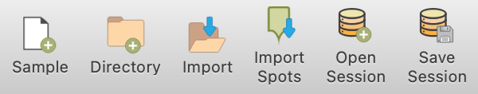
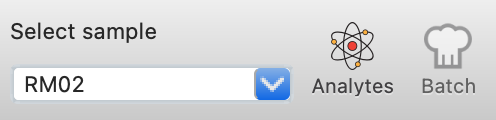
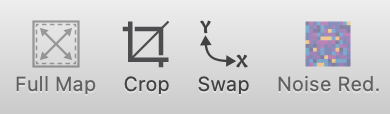
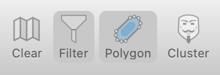
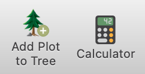
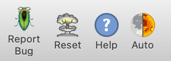

Main Toolbar (Top)
******************

The Main Toolbar, located at the top of the *LaME* interface, provides quick access to essential functions for data management, sample selection, and common operations.

Data Management
===============

Tools for loading, importing, and saving data.

   Data mamanage tools. 

Sample and Analyte Selector
===========================

Select samples and analystes for analysis. Changing analytes or samples updates the Plot Selector, clears clusters and PCA results, removes masks, and recomputes correlations.

   Sample and Analyte Selector provides quick access to switch sample or analyte in *LaME*.

Data Manipulation
=================

Tools for basic data operations including cropping the data view， swaping X and Y axes and swith for noice reducation. 

   Basic data manipulation tools in *LaMe*.

Filtering
=========

Quick access to turn filters on or off. 

   Filters. 

Shortcuts
=========

Convenient buttons for adding current plot to the plot tree and opening the calculator for custom computations.

   Shortcuts provides quick access to essential functions in *LaME*.

Help and Utilities
==================

Tools for reporting bugs, accessing help documentation, resetting the interface and changing the interface between dark and light mode. 

   Help. 
