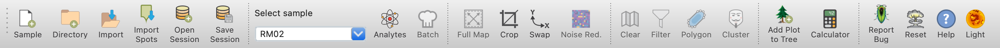

<<<<<<< HEAD
Main (Top) Toolbar
=======
Main Toolbar (Top)
>>>>>>> temp-branch
******************

The main toolbar provides quick access to essential functions and is divided into six sections:

Data Management
===============
This section includes tools for:

- Loading and importing data
- Opening existing projects
- Saving current work

Sample and Analyte Selection
============================
Here you'll find:

- Sample selector: Choose which sample to work with
- Analyte selector: Select specific analytes for analysis
<<<<<<< HEAD
=======
* Change Analytes:
* updates *Plot Selector*
* clear clusters, pca, removes masks
* recompute correlations
>>>>>>> temp-branch

Data Manipulation
=================
This section offers tools to:

- Crop the data view
- Swap X and Y axes
- Toggle noise reduction on and off

Filtering
=========
Quickly access filtering options:

- Turn filters on or off
- Access more detailed filtering options

Shortcuts
=========
Convenient shortcuts for frequently used functions:

- Add current plot to the plot tree
- Open the calculator for custom computations

Help and Utilities
==================
This section provides:

- A button to report bugs
- Access to help documentation
- Option to reset the interface

The main toolbar enhances workflow efficiency by providing easy access to these crucial functions, allowing users to quickly navigate between different aspects of data analysis and visualization in LaME.

   The Main Toolbar provides quick access to essential functions in *LaME*.