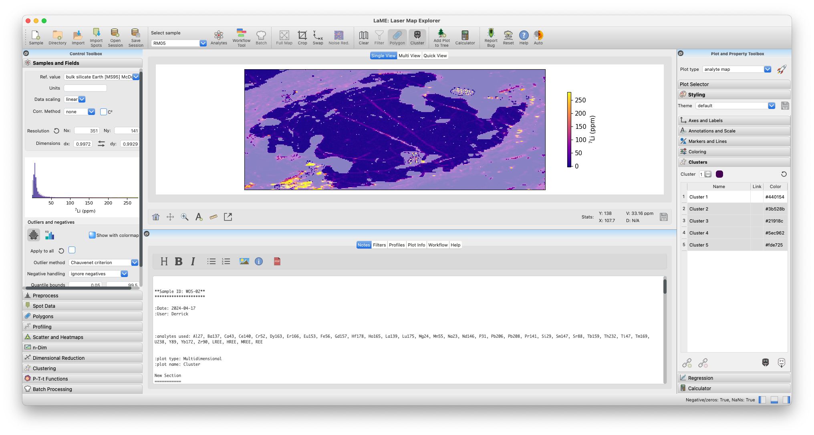
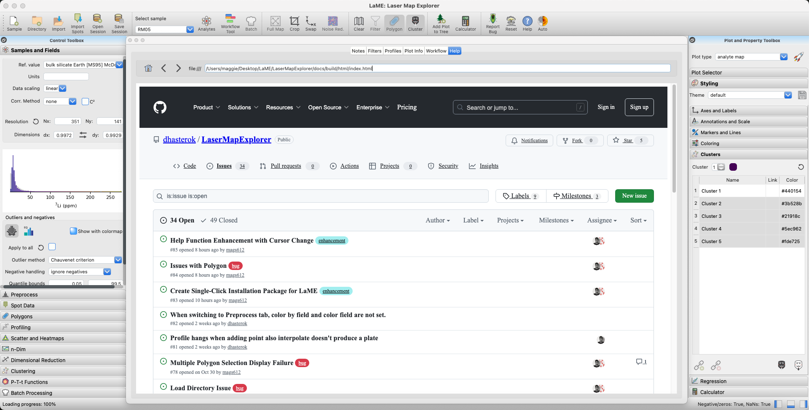

Main Toolbar (Top)
******************

The *Main Toolbar* provides quick access to essential functions for data management, sample selection, and common operations.

.. figure:: _static/screenshots/LaME_Main_Toolbar.png
   :align: center
   :alt: LaME interface: Main Toolbar
   :width: 600

   The *Main Toolbar* with key functions labeled

Data Management
===============

The data management section offers tools for loading, importing, and saving data.  You can load data by opening a directory (|icon-add-directory|) containing multiple sample data files or by loading a single sample file (|icon-open-file|).  For detailed information about importing data and supported formats, see :doc:`import`.  To preserve your work, use the save session button (|icon-save-session|) to store all analyses and plots.  Previously saved sessions can be retrieved using the load session button (|icon-open-session|).

Sample and Analyte Selector
===========================

The sample and analyte selector enables precise control over your analysis data. Use the sample dropdown to switch between loaded samples. The analyte selector (|icon-atom|) opens a tool for choosing elements and ratios to analyze. 

.. figure:: _static/screenshots/LaME_Analyte_Selector.png
    :align: center
    :alt: Analyte Selector interface
    :width: 450

    The *Analyte Selector* showing element selection matrix and ratio options

When using the analyte selector, click on a diagonal cell to select or deselect an analyte.  For ratios, click on the cell where the row (denominator) and column (numerator) of desired elements intersect. Selected ratios will be highlighted and added to the list on the right. The background colors represent correlation coefficients between pairs of fields, helping you identify potentially meaningful ratios.  Previously saved sets of analytes and ratios can be loaded using the 'Load Selection' button.

.. note::
   Changing analytes or samples will update the *Plot Selector*, clear any existing clusters and PCA results, remove masks, and recompute correlations. Consider saving your work before making major changes.

Data Manipulation
=================

The data manipulation section provides tools for basic operations on data.  The current view can be cropped (|icon-crop|) to focus on a specific area of interest.  Note that cropping modifies the raw data and will clear any existing analyses.  To restore the original extent after cropping, use the fit to width button (|icon-fit-to-width|).  For more details about how cropping affects your data, see :doc:`basics`.

For different perspectives on data, use the swap axes button (|icon-swap|) to interchange X and Y axes of the current plot.  The noise reduction toggle (|icon-noise-reduction-off|) applies a smoothing filter when enabled.  See :ref:`noise-reduction` in :doc:`left_toolbox` for detailed information about available noise reduction methods.

Filtering
=========

The filtering section of the toolbar provides quick access to control filters that have been set up in other parts of the program. While the actual setup of these filters occurs elsewhere in *LaME*, the toolbar allows for easily toggling them on and off, either individually or all at once.  For detailed information on setting up and using filters in *LaME*, please refer to the :doc:`filtering` page.

    Filter controls showing value filters, polygon masks, and cluster masks

Shortcuts
=========

The shortcuts section offers convenient buttons for frequently used functions.  YOu can add the current plot to the plot tree (|icon-tree|) for easy reference later.  The calculator button (|icon-calculator|) opens the tool for custom computations, enabling the creation of new fields or ratios based on existing data.  For detailed information about creating custom calculations, see :doc:`custom_fields`.

Help and Utilities
=================

The help and utilities section enhances your experience with *LaME*.  If you encounter any issues, report bugs directly through the interface using the bug report button (|icon-bug|).  Access comprehensive help documentation through the help button (|icon-question|).  To reset your workspace, use the reset interface button (|icon-nuke|) to clear the current session.  The theme toggle (|icon-sun-and-moon|) switches between dark and light modes to suit your working environment.

    Bug report interface showing GitHub integration for issue reporting

.. note::
   The reset interface button clears all current analyses and plots. Save your work before using this function if you want to preserve your analysis.

.. |icon-add-directory| image:: _static/icons/icon-add-directory-64.png
    :height: 2ex

.. |icon-open-file| image:: _static/icons/icon-open-file-64.png
    :height: 2ex

.. |icon-atom| image:: _static/icons/icon-atom-64.png
    :height: 2ex

.. |icon-crop| image:: _static/icons/icon-crop-64.png
    :height: 2ex

.. |icon-fit-to-width| image:: _static/icons/icon-fit-to-width-64.png
    :height: 2ex

.. |icon-calculator| image:: _static/icons/icon-calculator-64.png
    :height: 2ex

.. |icon-bug| image:: _static/icons/icon-bugs-64.png
    :height: 2ex

.. |icon-nuke| image:: _static/icons/icon-nuke-64.png
    :height: 2ex

.. |icon-sun-and-moon| image:: _static/icons/icon-sun-and-moon-64.png
    :height: 2ex
