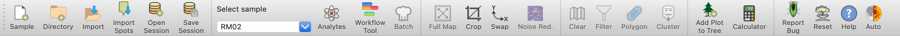

Main Toolbar (Top)
******************

The Main Toolbar provides quick access to essential functions for data management, sample selection, and common operations.

   *Main Toolbar* provides quick access to essential functions

Data Management
===============

This section offers tools for loading, importing, and saving data. Data can be loaded by opening a directory (|icon-add-directory|) containing multiple sample data files or by loading a single sample file (|icon-open-file|). To preserve work, the save session button (||icon-save-session|) stores all analyses and plots. Previously saved sessions can be retrieved using the load session button (|icon-open-session|).

Sample and Analyte Selector
===========================

The sample and analyte selector allows for choosing data to analyze.  The sample dropdown enables quick switching between loaded samples.  The analyte selector (|icon-atom|) opens a tool for choosing elements and ratios to analyze.  It's important to note that changing analytes or samples will update the *Plot Selector*, clear any existing clusters and PCA results, remove masks, and recompute correlations.

When using the analyte selector, click on a diagonal cell to select or deselect an analyte.  For ratios, click on the cell where the row (denominator) and column (numerator) of desired elements intersect. Selected ratios will be highlighted and added to the list on the right. The background colors represent correlation coefficients between pairs of fields, helping you identify potentially meaningful ratios.  Once you've made your selections, click 'Done'.  Previously saved sets of analytes and ratios can be loaded using the 'Load Selection' button.

Data Manipulation
=================

The data manipulation section provides tools for basic operations on data. The current view can be cropped (|icon-crop|) to focus on a specific area of interest, but it's important to note that this modifies the raw data and will clear any existing analyses.  To restore the original extent after cropping, the fit to width button (|icon-fit-to-width|) can be used.

For different perspectives on data, the X and Y axes (|icon-swap|) of the current plot can be swapped.  The noise reduction toggle (|icon-noise-reduction-off|) applies a smoothing filter when enabled, helping to reduce noise in the data.  

Filtering
=========

The filtering section of the toolbar provides quick access to control filters that have been set up in other parts of the program. While the actual setup of these filters occurs elsewhere in *LaME*, the toolbar allows for easily toggling them on and off, either individually or all at once. For detailed information on setting up and using filters in *LaME*, please refer to the :doc:`filtering` page.

Shortcuts
=========

The shortcuts section offers convenient buttons for frequently used functions. The current plot can be quickly added to the plot tree (|icon-tree|) for easy reference later.  The calculator button (|icon-calculator|) opens a tool for custom computations, allowing for the creation of new fields or ratios based on existing data.

Help and Utilities
==================

The help and utilities section provides tools to enhance the experience with *LaME*.  If you encounter any issues, you can report bugs directly through the interface (|icon-bug|).  For guidance on using *LaME*, access the help documentation (|icon-question|).  If a fresh start is needed, the reset interface button (|icon-nuke|) will clear the current session. Lastly, switching between dark and light modes (|icon-sun-and-moon|) is possible to suit visual preference or working environment.

.. |icon-add-directory| image:: _static/icons/icon-add-directory-64.png
    :height: 2ex

.. |icon-open-file| image:: _static/icons/icon-open-file-64.png
    :height: 2ex

.. |icon-save-session| image:: _static/icons/icon-save-session-64.png
    :height: 2ex

.. |icon-open-session| image:: _static/icons/icon-open-session-64.png
    :height: 2ex

.. |icon-atom| image:: _static/icons/icon-atom-64.png
    :height: 2ex

.. |icon-crop| image:: _static/icons/icon-crop-64.png
    :height: 2ex

.. |icon-fit-to-width| image:: _static/icons/icon-fit-to-width-64.png
    :height: 2ex

.. |icon-noise-reduction-off| image:: _static/icons/icon-noise-reduction-off-64.png
    :height: 2ex

.. |icon-tree| image:: _static/icons/icon-tree-64.png
    :height: 2ex

.. |icon-calculator| image:: _static/icons/icon-calculator-64.png
    :height: 2ex

.. |icon-nuke| image:: _static/icons/icon-nuke-64.png
    :height: 2ex

