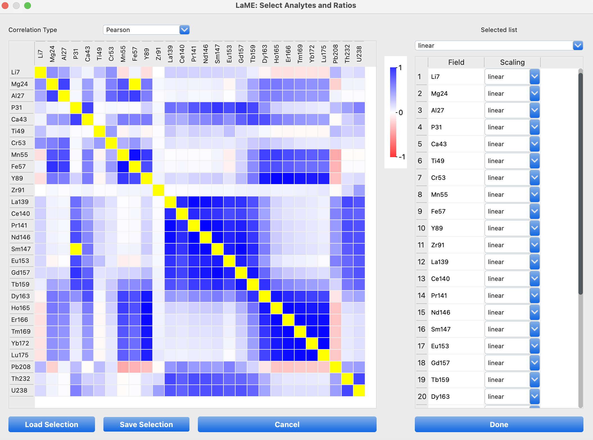

Main Toolbar (Top)
******************

The Main Toolbar, located at the top of the *LaME* interface, provides quick access to essential functions for data management, sample selection, and common operations.

Data Management
===============

This section offers tools for loading, importing, and saving data. You can open a directory (|icon-add-directory|) containing multiple sample data files or load a single sample file (|icon-add-file|). To preserve your work, use the save session button (|icon-save|) to store all your analyses and plots.  You can later retrieve this session using the load session button (|icon-folder-open|).

   Data Management section for opening directories, loading samples, and saving or loading sessions.

Sample and Analyte Selector
===========================

The sample and analyte selector allows you to choose which data you want to analyze. Use the sample dropdown (|icon-dropdown|) to quickly switch between loaded samples.  The analyte selector (|icon-atom|) opens a powerful tool for choosing elements and ratios to analyze.  Remember, changing analytes or samples will update the Plot Selector, clear any existing clusters and PCA results, remove masks, and recompute correlations.

.. figure:: _static/screenshots/LaME_Main_Sample.png
   :align: center
   :alt: LaME interface: Main Toolbar, sample and analyte selector
   :width: 400

   Sample and Analyte Selector provides quick access to switch sample or analyte in *LaME*.

When using the analyte selector, click on a diagonal cell to select or deselect an analyte. For ratios, click on the cell where the row (denominator) and column (numerator) of your desired elements intersect. Selected ratios will be highlighted and added to the list on the right. The background colors represent correlation coefficients between pairs of fields, helping you identify potentially meaningful ratios. Once you've made your selections, click 'Done'. You can also load a previously saved set of analytes and ratios using the 'Load Selection' button.

    Analyte selection tool, with analytes and ratios selected.

Data Manipulation
=================

The data manipulation section provides tools for basic operations on your data. You can crop the current view (|icon-crop|) to focus on a specific area of interest, but be aware that this modifies the raw data and will clear any existing analyses. To restore the original extent after cropping, use the fit to width button (|icon-fit-to-width|).

For different perspectives on your data, you can swap the X and Y axes (|icon-swap|) of the current plot. The noise reduction toggle (|icon-noise-reduction|) applies a smoothing filter when enabled, helping to reduce noise in your data. The autoscale function (|icon-autoscale|) automatically adjusts the scale of your data, improving visibility and reducing the impact of extreme outliers.

.. figure:: _static/screenshots/LaME_Main_DataMani.png
   :align: center
   :alt: LaME interface: Main Toolbar, data manipulation
   :width: 400

   Data Manipulation tools for cropping, axis swapping, noise reduction, and autoscaling.

Filtering
=========

The filtering section of the toolbar provides quick access to control filters that you've set up in other parts of the program. While the actual setup of these filters occurs elsewhere in LaME, the toolbar allows you to easily toggle them on and off, either individually or all at once. To view your full dataset without any filters, you can use the show all data button.

.. figure:: _static/screenshots/LaME_Main_Filter.png
   :align: center
   :alt: LaME interface: Main Toolbar, filters
   :width: 400

   Filtering toggle buttons for various filter types and a 'show all data' option.

Shortcuts
=========

The shortcuts section offers convenient buttons for frequently used functions. You can quickly add the current plot to the plot tree (|icon-add-plot|) for easy reference later. The calculator button (|icon-calculator|) opens a tool for custom computations, allowing you to create new fields or ratios based on your existing data.

   Shortcut buttons for quick access to the plot tree and calculator functions.

Help and Utilities
==================

The help and utilities section provides tools to enhance your experience with LaME. If you encounter any issues, you can report bugs directly through the interface (|icon-bug|). For guidance on using LaME, access the help documentation (|icon-help|). If you need to start fresh, the reset interface button (|icon-reset|) will clear your current session. Lastly, you can switch between dark and light modes (|icon-dark-mode| / |icon-light-mode|) to suit your visual preference or working environment.

   Help and Utilities section for bug reporting, accessing help documentation, resetting the interface, and switching between dark and light modes.
