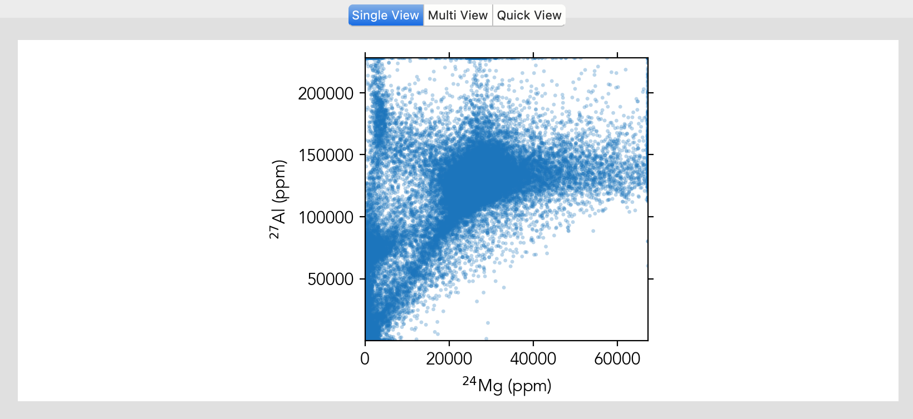
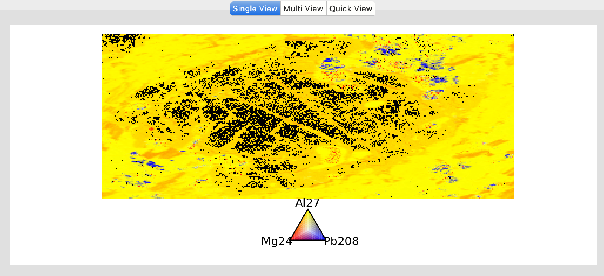
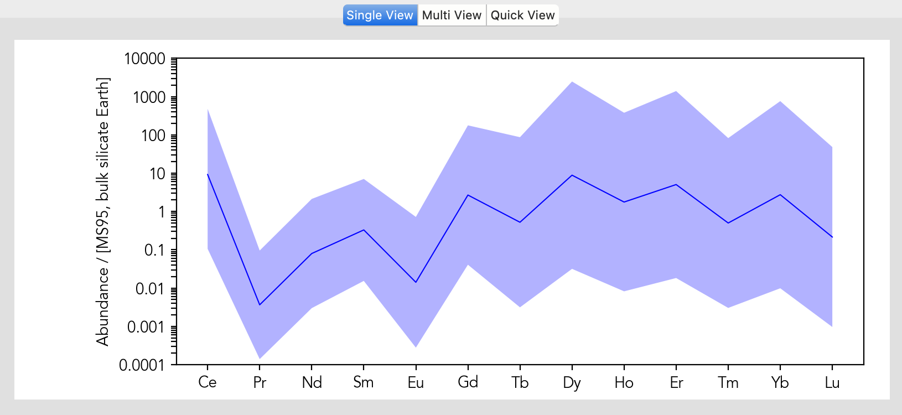

Analysis Visualization
**********************

Scatter and Heatmaps
====================

Scatter plots and heatmaps are common tools for visualizing relationships between analytes in two or three dimensions. These visualization techniques are fundamental in analyzing and understanding complex datasets.

    2D Scatter plot.

    3D Ternary plot.

Visulization Options
--------------------

- Scatter: Shows the relationship between two analytes
- Heatmap: Shows the distribution of a variable across two dimensions
- Ternaary: Shows the distribution of a variable across three dimensions

n-Dim Analysis
==============

n-Dimensional analysis is a powerful tool for visualizing complex datasets and understanding relationships between analytes in multiple dimensions. In addition, *LaME* provides options for customizing the analysis, such as setting reference values, selecting specific analytes, using predefined settings, and calculating quantiles. However, please note that the radar plot feature is currently not working.

    Spider plot using predefined settings.

Settings
--------

- Ref. value: choose a reference value for the analysis
- Analyte: select and add analytes for the analysis
- Predefined: choose predefined settings for the analysis (e.g., REE, full trace)
- Quantiles: select the number of quantiles for the analysis
